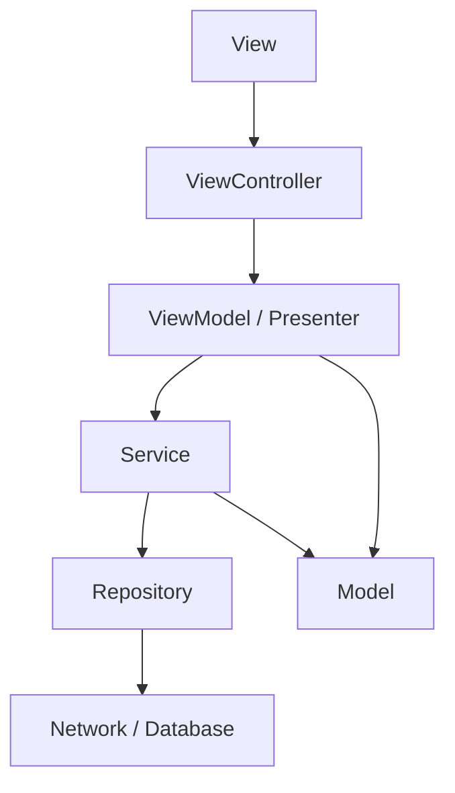

架构不是为了把项目写得复杂，而是为了让业务增长后仍然能修改、能测试、能定位问题。

iOS 项目最容易失控的地方是 ViewController。页面逻辑、网络请求、数据转换、跳转、埋点、权限判断全部放进去，短期很快，长期很难维护。

## 1. MVC

MVC 是 iOS 最基础的结构：

- Model：数据和业务状态。
- View：界面展示。
- Controller：协调 Model 和 View。

```objc
@interface YWUser : NSObject

@property (nonatomic, copy) NSString *name;
@property (nonatomic, assign) NSInteger age;

@end
```

```objc
@interface YWProfileView : UIView

- (void)renderWithUser:(YWUser *)user;

@end
```

```objc
@interface YWProfileViewController : UIViewController

@property (nonatomic, strong) YWUser *user;
@property (nonatomic, strong) YWProfileView *profileView;

@end
```

MVC 本身没有问题，问题通常出在 Controller 承担过多职责。

## 2. ViewController 的合理职责

ViewController 适合做：

- 页面生命周期管理。
- View 创建和布局。
- 用户事件转发。
- 页面状态协调。
- 导航跳转入口。

ViewController 不适合做：

- 大量网络请求细节。
- 复杂数据清洗。
- 跨页面业务流程。
- 本地缓存实现。
- 大量格式化逻辑。

一个判断标准：如果某段代码离开页面也有意义，它就不应该强依赖 ViewController。

## 3. Service 层

Service 用来封装业务能力，通常负责网络请求、数据转换和业务动作。

```objc
typedef void(^YWUserCompletion)(YWUser *user, NSError *error);

@interface YWUserService : NSObject

- (void)fetchUserWithId:(NSString *)userId completion:(YWUserCompletion)completion;

@end
```

```objc
@implementation YWUserService

- (void)fetchUserWithId:(NSString *)userId completion:(YWUserCompletion)completion {
    NSURL *url = [NSURL URLWithString:[NSString stringWithFormat:@"https://example.com/users/%@", userId]];

    NSURLSessionDataTask *task = [[NSURLSession sharedSession] dataTaskWithURL:url
                                                             completionHandler:^(NSData *data, NSURLResponse *response, NSError *error) {
        if (error) {
            dispatch_async(dispatch_get_main_queue(), ^{
                completion(nil, error);
            });
            return;
        }

        NSDictionary *json = [NSJSONSerialization JSONObjectWithData:data options:0 error:nil];
        YWUser *user = [[YWUser alloc] initWithDictionary:json];

        dispatch_async(dispatch_get_main_queue(), ^{
            completion(user, nil);
        });
    }];

    [task resume];
}

@end
```

这样 ViewController 只关心“我要用户数据”，不关心接口细节。

## 4. ViewModel

ViewModel 负责把业务数据转换成界面能直接使用的数据。

```objc
@interface YWUserViewModel : NSObject

@property (nonatomic, copy, readonly) NSString *displayName;
@property (nonatomic, copy, readonly) NSString *ageText;

- (instancetype)initWithUser:(YWUser *)user;

@end

@implementation YWUserViewModel

- (instancetype)initWithUser:(YWUser *)user {
    self = [super init];
    if (self) {
        _displayName = user.name.length > 0 ? user.name : @"未命名";
        _ageText = [NSString stringWithFormat:@"%ld 岁", (long)user.age];
    }
    return self;
}

@end
```

ViewModel 的价值是减少 ViewController 和 View 里的格式化逻辑。

## 5. MVVM

MVVM 可以理解为：

- Model：原始数据。
- View：展示和事件。
- ViewModel：页面展示状态和交互逻辑。
- ViewController：连接 View 和 ViewModel。

Objective-C 项目中不一定要追求复杂绑定。简单 MVVM 也可以只做输入输出方法。

```objc
@interface YWProfileViewModel : NSObject

@property (nonatomic, copy, readonly) NSString *title;

- (void)loadWithCompletion:(void(^)(NSError *error))completion;

@end
```

重点不是命名为 MVVM，而是把页面展示状态从 ViewController 中拆出来。

## 6. Router

Router 用来集中处理页面跳转。

```objc
@interface YWRouter : NSObject

+ (void)openProfileFrom:(UIViewController *)source userId:(NSString *)userId;

@end

@implementation YWRouter

+ (void)openProfileFrom:(UIViewController *)source userId:(NSString *)userId {
    YWProfileViewController *controller = [[YWProfileViewController alloc] initWithUserId:userId];
    [source.navigationController pushViewController:controller animated:YES];
}

@end
```

当项目页面多、跳转复杂时，Router 能减少页面之间的直接依赖。

## 7. Manager

Manager 常用于封装跨业务的通用能力，例如登录态、定位、图片缓存、播放状态。

```objc
@interface YWSessionManager : NSObject

@property (nonatomic, copy, readonly) NSString *token;

+ (instancetype)sharedManager;
- (BOOL)isLoggedIn;
- (void)logout;

@end
```

Manager 不应该变成万能类。一个 Manager 应该有清晰边界，只管理一个方向的能力。

## 8. 模块拆分

模块拆分的目标是降低依赖。

常见拆分方式：

- 按业务：登录、首页、订单、个人中心。
- 按能力：网络、存储、图片、日志、埋点。
- 按层次：基础库、业务基础层、业务模块、App 壳。

判断模块边界时可以问：

- 这个模块能否独立编译。
- 这个模块是否依赖了太多上层业务。
- 这个模块对外暴露的接口是否稳定。
- 修改这个模块会影响多少页面。

## 9. 胖 ViewController 拆分

拆分 ViewController 可以从几个方向开始：

- View 相关代码放到自定义 View。
- 网络请求放到 Service。
- 展示格式化放到 ViewModel。
- 跳转放到 Router。
- 复杂状态判断放到独立对象。
- 数据源和代理拆成单独类。

UITableView 数据源拆分示例：

```objc
@interface YWArticleDataSource : NSObject <UITableViewDataSource>

@property (nonatomic, copy) NSArray<YWArticle *> *articles;

@end

@implementation YWArticleDataSource

- (NSInteger)tableView:(UITableView *)tableView numberOfRowsInSection:(NSInteger)section {
    return self.articles.count;
}

- (UITableViewCell *)tableView:(UITableView *)tableView cellForRowAtIndexPath:(NSIndexPath *)indexPath {
    UITableViewCell *cell = [tableView dequeueReusableCellWithIdentifier:@"cell" forIndexPath:indexPath];
    cell.textLabel.text = self.articles[indexPath.row].title;
    return cell;
}

@end
```

这能让页面控制器少关心列表细节。

## 10. 架构的核心是依赖方向

架构不是文件夹名字，而是依赖方向。依赖方向混乱，项目就会变成到处互相调用。

更健康的方向是：



上层可以依赖下层抽象，下层不应该反过来依赖具体页面。网络层不应该知道某个 ViewController，数据库层不应该弹 Toast。

## 11. MVC 为什么容易变成 Massive View Controller

UIKit 的 MVC 在工程里经常变形：

- ViewController 创建 View。
- ViewController 请求接口。
- ViewController 解析 JSON。
- ViewController 格式化文本。
- ViewController 处理跳转。
- ViewController 做埋点。
- ViewController 处理缓存。

结果是一个页面几千行，任何小改动都要读半天。

拆分原则：

- 视图结构归 View。
- 业务请求归 Service。
- 展示状态归 ViewModel。
- 路由跳转归 Router。
- 持久化归 Repository 或 Store。
- 跨业务能力归 Manager，但 Manager 不能变成万能工具箱。

## 12. Repository 层

Service 偏业务动作，Repository 偏数据来源。它可以决定从网络、缓存还是数据库读取。

```objc
NS_ASSUME_NONNULL_BEGIN

@interface YWArticleRepository : NSObject

- (void)loadArticlesWithCompletion:(void (^)(NSArray<YWArticle *> * _Nullable articles,
                                             NSError * _Nullable error))completion;

@end

NS_ASSUME_NONNULL_END
```

实现可以先读缓存，再请求网络：

```objc
- (void)loadArticlesWithCompletion:(void (^)(NSArray<YWArticle *> * _Nullable, NSError * _Nullable))completion {
    NSArray<YWArticle *> *cachedArticles = [self.cacheStore cachedArticles];
    if (cachedArticles.count > 0) {
        completion(cachedArticles, nil);
    }

    [self.apiClient fetchArticlesWithCompletion:^(NSArray<YWArticle *> * _Nullable articles, NSError * _Nullable error) {
        if (articles.count > 0) {
            [self.cacheStore saveArticles:articles];
        }
        completion(articles, error);
    }];
}
```

页面不需要知道数据来自缓存还是网络，这就是 Repository 的价值。

## 13. ViewModel 不只是格式化

ViewModel 可以承担页面状态。

```objc
typedef NS_ENUM(NSInteger, YWArticleListState) {
    YWArticleListStateIdle,
    YWArticleListStateLoading,
    YWArticleListStateContent,
    YWArticleListStateEmpty,
    YWArticleListStateError
};

@interface YWArticleListViewModel : NSObject

@property (nonatomic, assign, readonly) YWArticleListState state;
@property (nonatomic, copy, readonly) NSArray<YWArticleCellViewModel *> *cellViewModels;

- (void)reloadWithCompletion:(void (^)(void))completion;

@end
```

页面根据状态渲染：

```objc
- (void)render {
    switch (self.viewModel.state) {
        case YWArticleListStateLoading:
            [self showLoadingView];
            break;
        case YWArticleListStateContent:
            [self.tableView reloadData];
            break;
        case YWArticleListStateEmpty:
            [self showEmptyView];
            break;
        case YWArticleListStateError:
            [self showErrorView];
            break;
        default:
            break;
    }
}
```

这样状态变化有明确入口，而不是散落在多个回调里。

## 14. Router 的边界

Router 可以集中跳转，但不要把业务判断全部塞进 Router。Router 应该处理页面创建和导航动作，业务条件仍应在业务层判断。

```objc
@interface YWAppRouter : NSObject

+ (void)openArticleDetailFrom:(UIViewController *)source articleId:(NSString *)articleId;

@end
```

```objc
+ (void)openArticleDetailFrom:(UIViewController *)source articleId:(NSString *)articleId {
    if (articleId.length == 0) {
        return;
    }

    YWArticleDetailViewController *controller = [[YWArticleDetailViewController alloc] initWithArticleId:articleId];
    [source.navigationController pushViewController:controller animated:YES];
}
```

Router 可以防御非法参数，但不应该决定“用户是否有权限看文章”这种业务规则。

## 15. 模块通信

模块之间不要互相 import 具体实现。常见方式：

- 通过协议暴露能力。
- 通过 Router 统一跳转。
- 通过事件通知状态变化。
- 通过依赖注入传入服务。

协议示例：

```objc
@protocol YWLoginServiceProtocol <NSObject>

- (BOOL)isLoggedIn;
- (void)requireLoginFrom:(UIViewController *)source completion:(void (^)(BOOL success))completion;

@end
```

业务模块依赖协议，而不是依赖具体登录模块类。

## 16. 可测试性

架构拆分的一个直接收益是可测试。

如果 ViewModel 依赖协议，就可以在测试中传入假数据：

```objc
@interface YWMockArticleRepository : NSObject

@property (nonatomic, copy) NSArray<YWArticle *> *stubArticles;

@end
```

```objc
- (void)loadArticlesWithCompletion:(void (^)(NSArray<YWArticle *> *, NSError *))completion {
    completion(self.stubArticles, nil);
}
```

如果所有逻辑都写在 ViewController 里，测试就必须启动页面、模拟生命周期、处理 UI 依赖，成本会高很多。

## 17. 架构演进不要一步到位

小项目不需要一开始就上复杂分层。更实际的演进路径：

1. 先把 ViewController 中的 View 拆出去。
2. 再把网络请求拆到 Service。
3. 再把数据来源整合到 Repository。
4. 页面状态复杂后引入 ViewModel。
5. 页面跳转复杂后引入 Router。
6. 模块变多后再做组件化边界。

架构是为复杂度付费。复杂度没到时，过度设计也是成本。

## 18. Swift 混编提示

混编项目中，架构边界比语言边界更重要。

- Objective-C 基础库可以被 Swift 调用，但要补 Nullability。
- Swift 新模块暴露给 Objective-C 时，用 Facade 包一层。
- 不要让 Objective-C 页面直接依赖大量 Swift 内部类型。
- 公共协议要使用两边都容易理解的类型。

```swift
@objcMembers
final class YWArticleModuleFacade: NSObject {
    static func makeArticleListViewController() -> UIViewController {
        return ArticleListViewController()
    }
}
```

Objective-C 只拿 `UIViewController`，不需要理解 Swift 模块内部结构。

## 19. 掌握标准

掌握架构，需要能做到：

- 能解释 MVC 中各层职责。
- 能识别 ViewController 过重的原因。
- 能把网络请求、格式化、跳转从页面中拆出去。
- 能设计简单 Service 和 ViewModel。
- 能理解 Router 解决的是页面依赖问题。
- 能判断 Manager 是否职责过大。
- 能按业务或能力拆分模块。
- 能让代码结构服务于长期维护，而不是只追求命名模式。
