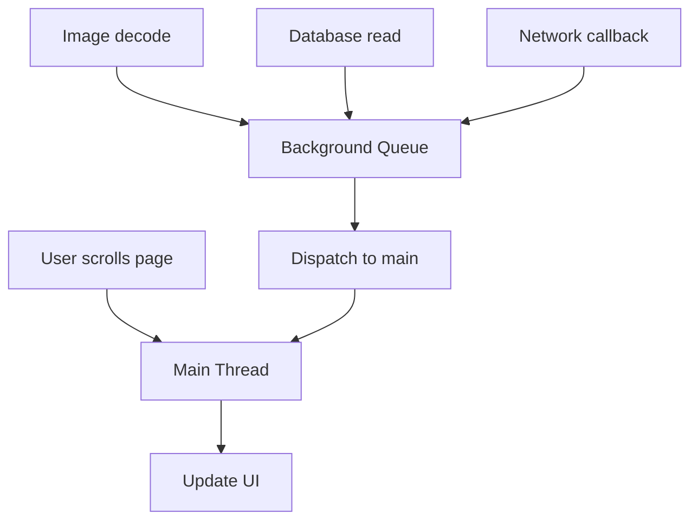

多线程的目标不是“让代码同时跑起来”这么简单，而是让耗时任务不阻塞界面，同时保证共享数据不会被并发访问破坏。

iOS 开发里最重要的规则：UI 必须在主线程更新，耗时任务应该放到后台线程。

## 1. 主线程

主线程负责处理 UI 绘制、触摸事件、页面跳转和大部分用户交互。

如果在主线程做耗时操作，用户看到的就是卡顿、按钮无响应、滚动掉帧。

```objc
// 错误示例：在主线程执行耗时任务
- (void)viewDidLoad {
    [super viewDidLoad];

    NSData *data = [NSData dataWithContentsOfURL:[NSURL URLWithString:@"https://example.com/image.png"]];
    self.imageView.image = [UIImage imageWithData:data];
}
```

这段代码会阻塞页面加载。正确思路是后台加载，主线程更新 UI。

```objc
dispatch_async(dispatch_get_global_queue(DISPATCH_QUEUE_PRIORITY_DEFAULT, 0), ^{
    NSData *data = [NSData dataWithContentsOfURL:[NSURL URLWithString:@"https://example.com/image.png"]];
    UIImage *image = [UIImage imageWithData:data];

    dispatch_async(dispatch_get_main_queue(), ^{
        self.imageView.image = image;
    });
});
```

## 2. GCD

GCD 是 iOS 中最常用的多线程工具。它的核心概念是队列和任务。

- 队列：决定任务怎么执行。
- 任务：需要执行的代码块。

常用队列：

- 主队列：`dispatch_get_main_queue()`。
- 全局并发队列：`dispatch_get_global_queue(...)`。
- 自定义串行队列：一次只执行一个任务。
- 自定义并发队列：可以同时执行多个任务。

```objc
dispatch_queue_t queue = dispatch_queue_create("com.yawzhang.image.decode", DISPATCH_QUEUE_SERIAL);

dispatch_async(queue, ^{
    NSLog(@"decode image");
});
```

## 3. 同步与异步

同步和异步描述的是当前线程是否等待任务完成。

- `dispatch_sync`：提交任务后等待执行完成。
- `dispatch_async`：提交任务后立即返回。

```objc
dispatch_queue_t queue = dispatch_queue_create("com.yawzhang.task", DISPATCH_QUEUE_SERIAL);

dispatch_async(queue, ^{
    NSLog(@"async task");
});

NSLog(@"continue");
```

这里 `continue` 不需要等待 `async task` 完成。

危险写法：

```objc
dispatch_sync(dispatch_get_main_queue(), ^{
    NSLog(@"deadlock");
});
```

如果这段代码已经在主线程执行，就会死锁。主线程等待主队列任务完成，而主队列任务又要等主线程空出来。

## 4. 串行队列与并发队列

串行队列一次执行一个任务，适合保护顺序。

```objc
dispatch_queue_t serialQueue = dispatch_queue_create("com.yawzhang.write", DISPATCH_QUEUE_SERIAL);

dispatch_async(serialQueue, ^{
    NSLog(@"write file A");
});

dispatch_async(serialQueue, ^{
    NSLog(@"write file B");
});
```

并发队列可以同时执行多个任务，适合互不依赖的耗时操作。

```objc
dispatch_queue_t concurrentQueue = dispatch_queue_create("com.yawzhang.download", DISPATCH_QUEUE_CONCURRENT);

dispatch_async(concurrentQueue, ^{
    NSLog(@"download image 1");
});

dispatch_async(concurrentQueue, ^{
    NSLog(@"download image 2");
});
```

选择队列时先判断任务之间是否有顺序依赖，有依赖就不要盲目并发。

## 5. dispatch_group

多个异步任务都完成后再执行下一步，可以用 `dispatch_group`。

```objc
dispatch_group_t group = dispatch_group_create();
dispatch_queue_t queue = dispatch_get_global_queue(DISPATCH_QUEUE_PRIORITY_DEFAULT, 0);

dispatch_group_async(group, queue, ^{
    NSLog(@"request user info");
});

dispatch_group_async(group, queue, ^{
    NSLog(@"request order list");
});

dispatch_group_notify(group, dispatch_get_main_queue(), ^{
    NSLog(@"reload page");
});
```

典型场景是页面需要多个接口数据，全部完成后统一刷新。

## 6. dispatch_barrier

并发读、独占写可以使用 barrier。

```objc
dispatch_queue_t queue = dispatch_queue_create("com.yawzhang.cache", DISPATCH_QUEUE_CONCURRENT);

dispatch_async(queue, ^{
    NSLog(@"read cache");
});

dispatch_barrier_async(queue, ^{
    NSLog(@"write cache");
});

dispatch_async(queue, ^{
    NSLog(@"read cache again");
});
```

barrier 前面的任务执行完成后，barrier 任务独占执行；它完成后，后面的任务再继续并发。

## 7. NSOperationQueue

`NSOperationQueue` 比 GCD 更适合表达任务对象、依赖关系、取消和并发数量控制。

```objc
NSOperationQueue *queue = [[NSOperationQueue alloc] init];
queue.maxConcurrentOperationCount = 2;

NSBlockOperation *download = [NSBlockOperation blockOperationWithBlock:^{
    NSLog(@"download");
}];

NSBlockOperation *parse = [NSBlockOperation blockOperationWithBlock:^{
    NSLog(@"parse");
}];

[parse addDependency:download];

[queue addOperation:download];
[queue addOperation:parse];
```

这里 `parse` 会等 `download` 完成后再执行。

## 8. 线程安全

线程安全问题来自多个线程同时读写同一份可变数据。

```objc
@property (nonatomic, strong) NSMutableArray *items;
```

如果多个线程同时修改 `items`，可能出现崩溃或数据错乱。

常见解决方式：

- 把读写都放到同一个串行队列。
- 使用锁保护临界区。
- 尽量使用不可变对象。
- 避免把可变集合暴露给外部直接修改。

串行队列保护示例：

```objc
@interface YWStore ()

@property (nonatomic, strong) NSMutableArray *items;
@property (nonatomic) dispatch_queue_t queue;

@end

@implementation YWStore

- (instancetype)init {
    self = [super init];
    if (self) {
        _items = [NSMutableArray array];
        _queue = dispatch_queue_create("com.yawzhang.store", DISPATCH_QUEUE_SERIAL);
    }
    return self;
}

- (void)addItem:(id)item {
    dispatch_async(self.queue, ^{
        [self.items addObject:item];
    });
}

@end
```

## 9. 异步回调中的 self

异步任务会延长 Block 的生命周期。Block 捕获 `self` 时要注意循环引用和对象释放后的回调。

```objc
__weak typeof(self) weakSelf = self;

dispatch_async(dispatch_get_global_queue(DISPATCH_QUEUE_PRIORITY_DEFAULT, 0), ^{
    NSString *result = @"done";

    dispatch_async(dispatch_get_main_queue(), ^{
        __strong typeof(weakSelf) self = weakSelf;
        if (!self) {
            return;
        }

        self.titleLabel.text = result;
    });
});
```

`weakSelf` 避免 Block 强持有页面，`strongSelf` 保证回调执行期间对象不被释放。

## 10. 多线程真正要解决的三类问题

多线程不是为了把代码写得更复杂。它解决三类问题：

- 响应性：耗时任务不阻塞主线程。
- 吞吐量：多个独立任务并发执行。
- 一致性：共享数据在并发访问下不被破坏。



主线程不是不能执行任何逻辑，而是不能执行会让用户感知到卡顿的耗时逻辑。

## 11. 串行队列为什么能保护数据

线程安全的核心是：同一时刻不能有多个线程同时修改同一份可变状态。

串行队列能保护数据，是因为它保证提交到队列里的任务一次只执行一个。

```objc
NS_ASSUME_NONNULL_BEGIN

@interface YWThreadSafeArray<ObjectType> : NSObject

- (void)addObject:(ObjectType)object;
- (NSArray<ObjectType> *)allObjects;

@end

NS_ASSUME_NONNULL_END

@implementation YWThreadSafeArray {
    NSMutableArray *_storage;
    dispatch_queue_t _queue;
}

- (instancetype)init {
    self = [super init];
    if (self) {
        _storage = [NSMutableArray array];
        _queue = dispatch_queue_create("com.yawzhang.thread-safe-array", DISPATCH_QUEUE_SERIAL);
    }
    return self;
}

- (void)addObject:(id)object {
    if (!object) {
        return;
    }

    dispatch_async(_queue, ^{
        [self->_storage addObject:object];
    });
}

- (NSArray *)allObjects {
    __block NSArray *objects = nil;
    dispatch_sync(_queue, ^{
        objects = [self->_storage copy];
    });
    return objects ?: @[];
}

@end
```

注意 `allObjects` 返回 copy，避免外部拿到内部可变数组后绕过队列修改。

## 12. 锁和队列怎么选

常见同步工具：

- 串行队列：适合把状态访问统一排队。
- `NSLock`：适合短小临界区。
- `@synchronized`：简单但开销和可控性一般。
- `dispatch_semaphore`：适合限制并发数量或等待资源。
- `pthread_mutex` / `os_unfair_lock`：更底层，适合性能敏感场景。

`NSLock` 示例：

```objc
@interface YWCounter : NSObject

@property (nonatomic, assign, readonly) NSInteger value;
- (void)increase;

@end

@implementation YWCounter {
    NSInteger _value;
    NSLock *_lock;
}

- (instancetype)init {
    self = [super init];
    if (self) {
        _lock = [[NSLock alloc] init];
    }
    return self;
}

- (void)increase {
    [_lock lock];
    _value += 1;
    [_lock unlock];
}

- (NSInteger)value {
    [_lock lock];
    NSInteger value = _value;
    [_lock unlock];
    return value;
}

@end
```

临界区里不要做网络请求、文件 IO、复杂回调。锁住的范围越大，死锁和卡顿风险越高。

## 13. atomic 不等于线程安全

`atomic` 只保证属性 getter/setter 的单次读写相对完整，不保证复合操作安全。

```objc
@property (atomic, assign) NSInteger count;

// 不是线程安全
self.count = self.count + 1;
```

这行代码至少包含读取、加一、写回三个步骤。多个线程同时执行仍然可能丢失更新。

真正需要线程安全时，要用锁或队列保护整个复合操作。

## 14. 死锁的本质

死锁通常来自互相等待。

主队列死锁：

```objc
dispatch_sync(dispatch_get_main_queue(), ^{
    NSLog(@"never execute if already on main thread");
});
```

如果当前已经在主线程，主线程在等待 block 执行；而 block 又必须等主线程空出来才能执行。

更隐蔽的死锁是串行队列递归同步：

```objc
dispatch_queue_t queue = dispatch_queue_create("com.yawzhang.serial", DISPATCH_QUEUE_SERIAL);

dispatch_async(queue, ^{
    dispatch_sync(queue, ^{
        NSLog(@"deadlock");
    });
});
```

同一个串行队列正在执行外层任务，外层任务同步等待内层任务，内层任务又排在队列后面，无法开始。

## 15. dispatch_group 的错误聚合

多个请求并发完成后，不只要知道“都结束了”，还要收集错误。

```objc
dispatch_group_t group = dispatch_group_create();
dispatch_queue_t lockQueue = dispatch_queue_create("com.yawzhang.errors", DISPATCH_QUEUE_SERIAL);
NSMutableArray<NSError *> *errors = [NSMutableArray array];

for (NSURL *url in urls) {
    dispatch_group_enter(group);
    [self.client requestURL:url completion:^(id _Nullable object, NSError * _Nullable error) {
        if (error) {
            dispatch_sync(lockQueue, ^{
                [errors addObject:error];
            });
        }
        dispatch_group_leave(group);
    }];
}

dispatch_group_notify(group, dispatch_get_main_queue(), ^{
    if (errors.count > 0) {
        [self showErrors:errors];
        return;
    }

    [self reloadPage];
});
```

只要共享数组可能被多个回调同时写，就必须保护。

## 16. Operation 适合可取消任务

GCD block 提交后不好取消；`NSOperation` 更适合可取消、可依赖、可控制并发数的任务。

```objc
@interface YWImageDecodeOperation : NSOperation

@property (nonatomic, strong, readonly, nullable) UIImage *image;
- (instancetype)initWithData:(NSData *)data;

@end

@implementation YWImageDecodeOperation {
    NSData *_data;
}

- (instancetype)initWithData:(NSData *)data {
    self = [super init];
    if (self) {
        _data = [data copy];
    }
    return self;
}

- (void)main {
    if (self.isCancelled) {
        return;
    }

    UIImage *image = [UIImage imageWithData:_data];

    if (self.isCancelled) {
        return;
    }

    _image = image;
}

@end
```

取消不是强行杀线程，而是任务自己在合适位置检查 `isCancelled` 并停止后续工作。

## 17. Swift 混编提示

Swift 的 async/await、Task、Actor 能改善异步表达，但和 Objective-C GCD 混用时要注意边界：

- Objective-C 回调进入 Swift 后，UI 更新仍要回主线程或 `MainActor`。
- Swift closure 捕获 Objective-C 对象同样可能循环引用。
- Objective-C API 如果没有 Nullability，Swift 并发代码里更容易误用空值。

Objective-C 回调 API 应清楚表达线程约定：

```objc
/// completion is called on the main queue.
- (void)loadProfileWithCompletion:(void (^)(YWProfile * _Nullable profile,
                                            NSError * _Nullable error))completion;
```

线程约定要写进接口注释或命名里，否则调用方只能猜。

## 18. 掌握标准

掌握多线程，需要能做到：

- 能解释主线程为什么不能做耗时任务。
- 能用 GCD 完成后台任务和主线程 UI 更新。
- 能区分同步、异步、串行、并发。
- 能识别 `dispatch_sync` 主队列死锁。
- 能用 `dispatch_group` 组织多个异步任务。
- 能用串行队列或锁保护共享可变数据。
- 能判断什么时候使用 `NSOperationQueue`。
- 能在异步回调中正确处理 `self`。
