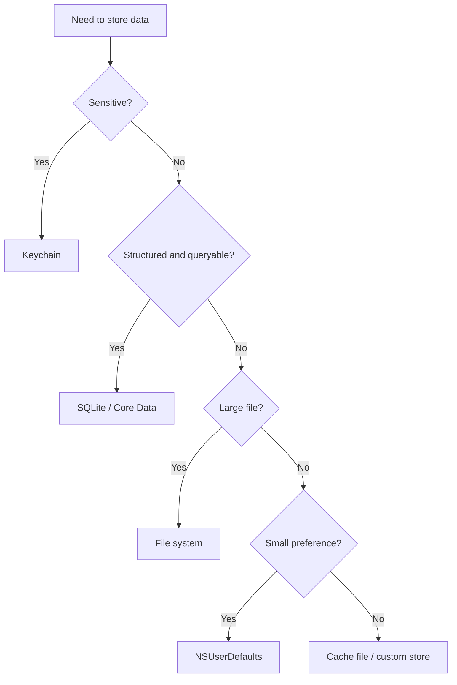

数据存储解决的是一个问题：App 退出、页面销毁、网络断开以后，哪些数据还应该被保存，保存在哪里，下一次如何恢复。

iOS 开发里不要把“能存下来”当成唯一标准。更重要的是判断数据类型、生命周期、读写频率、安全性和迁移成本。

## 1. 数据存储的分类

常见数据大致分成几类：

- 用户偏好：开关状态、主题、是否首次启动。
- 业务缓存：列表数据、接口返回、图片缓存。
- 本地文件：图片、音频、日志、导出的文档。
- 结构化数据：订单、消息、联系人、搜索记录。
- 敏感数据：Token、账号凭证、加密密钥。

不同数据对应不同存储方式。

| 数据类型 | 推荐方式 |
| --- | --- |
| 简单配置 | `NSUserDefaults` |
| 普通文件 | 沙盒文件目录 |
| 图片缓存 | 文件缓存或缓存库 |
| 结构化数据 | SQLite / Core Data |
| 敏感凭证 | Keychain |

## 2. 沙盒目录

iOS App 运行在沙盒中，默认不能随意访问其他 App 的文件。常用目录包括：

- `Documents`：用户生成或需要长期保留的数据。
- `Library/Caches`：缓存数据，系统空间紧张时可能清理。
- `Library/Preferences`：偏好设置，`NSUserDefaults` 会使用这里。
- `tmp`：临时文件，随时可能被清理。

获取路径：

```objc
NSString *documentPath = NSSearchPathForDirectoriesInDomains(NSDocumentDirectory, NSUserDomainMask, YES).firstObject;
NSString *cachePath = NSSearchPathForDirectoriesInDomains(NSCachesDirectory, NSUserDomainMask, YES).firstObject;
NSString *tempPath = NSTemporaryDirectory();

NSLog(@"Documents: %@", documentPath);
NSLog(@"Caches: %@", cachePath);
NSLog(@"tmp: %@", tempPath);
```

目录选择会影响数据是否应该被 iCloud 备份、是否可能被系统清理、是否应该长期保留。

## 3. NSUserDefaults

`NSUserDefaults` 适合保存少量简单配置，不适合保存大对象、图片、复杂列表。

```objc
NSUserDefaults *defaults = [NSUserDefaults standardUserDefaults];
[defaults setBool:YES forKey:@"hasCompletedGuide"];
[defaults setObject:@"dark" forKey:@"theme"];

BOOL completed = [defaults boolForKey:@"hasCompletedGuide"];
NSString *theme = [defaults stringForKey:@"theme"];
```

它的优点是简单，缺点也很明显：结构弱、难迁移、不适合频繁写入，不适合存敏感信息。

## 4. 文件存储

文件存储适合保存文本、图片、JSON、日志等完整文件。

```objc
NSString *documents = NSSearchPathForDirectoriesInDomains(NSDocumentDirectory, NSUserDomainMask, YES).firstObject;
NSString *filePath = [documents stringByAppendingPathComponent:@"note.txt"];

NSError *writeError = nil;
[@"Objective-C storage" writeToFile:filePath
                          atomically:YES
                            encoding:NSUTF8StringEncoding
                               error:&writeError];

if (writeError) {
    NSLog(@"write failed: %@", writeError.localizedDescription);
}

NSError *readError = nil;
NSString *content = [NSString stringWithContentsOfFile:filePath
                                              encoding:NSUTF8StringEncoding
                                                 error:&readError];
NSLog(@"content: %@", content);
```

`atomically:YES` 表示先写入临时文件，再替换目标文件，能降低写入一半时崩溃造成文件损坏的概率。

## 5. JSON 与 Model

接口返回通常是 JSON，但业务代码不应该到处直接读取字典字段。更清晰的方式是转成 Model。

```objc
@interface YWUser : NSObject

@property (nonatomic, copy) NSString *userId;
@property (nonatomic, copy) NSString *name;
@property (nonatomic, assign) NSInteger age;

- (instancetype)initWithDictionary:(NSDictionary *)dictionary;

@end

@implementation YWUser

- (instancetype)initWithDictionary:(NSDictionary *)dictionary {
    self = [super init];
    if (self) {
        _userId = [[dictionary objectForKey:@"id"] description];
        _name = [[dictionary objectForKey:@"name"] description];
        _age = [[dictionary objectForKey:@"age"] integerValue];
    }
    return self;
}

@end
```

Model 的价值不是多写一层代码，而是把数据结构集中管理。字段改名、默认值、类型转换、空值处理都可以放在同一个地方。

## 6. SQLite

SQLite 适合本地结构化数据，尤其是需要查询、排序、分页、过滤的数据。

概念上可以把它理解为 App 内置的小型数据库。

```objc
// 示例只表达 SQL 意图，实际项目通常会使用 FMDB 或自己封装 sqlite3。
NSString *sql = @"CREATE TABLE IF NOT EXISTS message (id TEXT PRIMARY KEY, text TEXT, time INTEGER)";
```

SQLite 的优势：

- 查询能力强。
- 能处理较大量结构化数据。
- 数据格式稳定，便于迁移。

代价是需要管理表结构、SQL、版本升级和线程访问。

## 7. Core Data

Core Data 不是简单的“数据库封装”，它更像对象图管理框架。它能把对象、关系、查询、变更跟踪、持久化组织起来。

适合：

- 对象关系较复杂。
- 需要增删改查和关系管理。
- 需要和系统能力配合，比如批量更新、Fetched Results Controller。

不适合：

- 只存几个配置项。
- 数据结构很简单但团队没有 Core Data 经验。
- 希望快速直接控制 SQL 细节。

学习 Core Data 时要掌握四个核心对象：

- `NSManagedObjectModel`：数据模型。
- `NSPersistentStoreCoordinator`：持久化协调器。
- `NSManagedObjectContext`：对象上下文。
- `NSManagedObject`：被管理的对象。

## 8. Keychain

Keychain 用来保存敏感信息，比如 Token、密码、证书、私钥。它比 `NSUserDefaults` 和普通文件更适合保存凭证。

关键点：

- 不要把 Token 明文存进 `NSUserDefaults`。
- 不要把密钥写在代码里。
- Keychain API 偏底层，项目里通常会封装一层。

```objc
// 实际项目建议封装 Keychain 读写，避免业务层直接处理 SecItemAdd / SecItemCopyMatching。
NSString *token = @"access-token";
NSLog(@"save token to keychain: %@", token);
```

这里不展开完整 Keychain C API，先理解它的使用场景。等进入登录态、账号系统、安全加固时，再系统学习。

## 9. 缓存设计

缓存不是“把数据存下来”这么简单，它还要回答：

- 数据什么时候过期。
- 网络失败时能不能使用旧数据。
- 缓存占用空间是否可控。
- 用户退出登录时是否要清理。
- 同一个接口的不同参数如何区分缓存 key。

一个简单缓存 key 可以由接口路径和参数组成：

```objc
- (NSString *)cacheKeyWithPath:(NSString *)path parameters:(NSDictionary *)parameters {
    NSData *data = [NSJSONSerialization dataWithJSONObject:parameters ?: @{}
                                                   options:NSJSONWritingSortedKeys
                                                     error:nil];
    NSString *params = [[NSString alloc] initWithData:data encoding:NSUTF8StringEncoding];
    return [NSString stringWithFormat:@"%@_%@", path, params];
}
```

长期项目里，缓存策略比缓存代码更重要。没有过期策略的缓存，最终会变成难以解释的数据问题。

## 10. 数据迁移

本地数据一旦发布到用户设备上，就不能假设它永远和当前代码一致。

常见变化包括：

- 字段新增。
- 字段改名。
- 数据类型变化。
- 表结构变化。
- 老版本脏数据。

处理方式：

- Model 解析时给默认值。
- 数据库维护版本号。
- 升级时执行迁移脚本。
- 关键数据迁移前备份。

```objc
NSInteger currentVersion = 2;
NSInteger savedVersion = [[NSUserDefaults standardUserDefaults] integerForKey:@"databaseVersion"];

if (savedVersion < currentVersion) {
    // 执行迁移逻辑
    [[NSUserDefaults standardUserDefaults] setInteger:currentVersion forKey:@"databaseVersion"];
}
```

## 11. 存储方案的工程选择

存储方案不能只看 API 简单程度。要从数据特征判断：

- 数据是否敏感。
- 数据是否结构化。
- 数据是否需要查询。
- 数据是否需要跨版本迁移。
- 数据量是否会持续增长。
- 数据是否可以被系统清理。
- 数据是否要随账号切换清理。



这个判断比“NSUserDefaults 能不能存数组”更重要。能存不代表适合存。

## 12. 账号隔离

很多线上问题来自缓存没有按账号隔离。用户 A 退出登录，用户 B 登录后看到了 A 的缓存数据，这不是 UI 问题，而是存储设计问题。

推荐把账号维度放进存储路径或缓存 key：

```objc
- (NSString *)cacheDirectoryForUserId:(NSString *)userId {
    NSString *caches = NSSearchPathForDirectoriesInDomains(NSCachesDirectory, NSUserDomainMask, YES).firstObject;
    NSString *safeUserId = userId.length > 0 ? userId : @"anonymous";
    return [caches stringByAppendingPathComponent:safeUserId];
}
```

接口缓存 key 也应该包含用户维度：

```objc
- (NSString *)cacheKeyWithUserId:(NSString *)userId path:(NSString *)path parameters:(NSDictionary<NSString *, id> *)parameters {
    NSData *data = [NSJSONSerialization dataWithJSONObject:parameters ?: @{}
                                                   options:NSJSONWritingSortedKeys
                                                     error:nil];
    NSString *parameterText = [[NSString alloc] initWithData:data encoding:NSUTF8StringEncoding] ?: @"";
    return [NSString stringWithFormat:@"%@|%@|%@", userId ?: @"anonymous", path, parameterText];
}
```

退出登录时要清理用户相关缓存，但不一定清理全局配置，比如主题、语言、是否看过引导页。

## 13. 文件写入的原子性和错误处理

文件写入失败很常见：磁盘空间不足、路径不存在、权限问题、数据编码失败。

不要忽略错误：

```objc
- (BOOL)saveData:(NSData *)data toFileName:(NSString *)fileName error:(NSError **)error {
    NSString *documents = NSSearchPathForDirectoriesInDomains(NSDocumentDirectory, NSUserDomainMask, YES).firstObject;
    NSString *directory = [documents stringByAppendingPathComponent:@"articles"];

    NSFileManager *fileManager = [NSFileManager defaultManager];
    if (![fileManager fileExistsAtPath:directory]) {
        BOOL created = [fileManager createDirectoryAtPath:directory
                              withIntermediateDirectories:YES
                                               attributes:nil
                                                    error:error];
        if (!created) {
            return NO;
        }
    }

    NSString *path = [directory stringByAppendingPathComponent:fileName];
    return [data writeToFile:path options:NSDataWritingAtomic error:error];
}
```

`NSDataWritingAtomic` 会降低写坏文件的概率，但不能代替完整的错误处理。

## 14. SQLite 迁移的真实问题

SQLite 一旦发布，就要考虑版本升级。例如第一版表结构：

```sql
CREATE TABLE article (
    id TEXT PRIMARY KEY,
    title TEXT
);
```

第二版需要增加摘要：

```sql
ALTER TABLE article ADD COLUMN summary TEXT DEFAULT '';
```

迁移要按版本顺序执行，而不是只判断当前版本：

```objc
- (void)migrateDatabaseIfNeeded {
    NSInteger version = [self currentDatabaseVersion];

    if (version < 2) {
        [self executeSQL:@"ALTER TABLE article ADD COLUMN summary TEXT DEFAULT ''"];
        version = 2;
    }

    if (version < 3) {
        [self executeSQL:@"CREATE INDEX IF NOT EXISTS idx_article_time ON article(time)"];
        version = 3;
    }

    [self saveDatabaseVersion:version];
}
```

这样从 v1 升到 v3、从 v2 升到 v3 都能走正确路径。

## 15. Core Data 的上下文边界

Core Data 的核心难点不是创建实体，而是理解 `NSManagedObjectContext` 的线程边界。

`NSManagedObject` 不能随意跨线程传递。更稳妥的方式是传 `objectID`，在目标 context 中重新获取对象。

```objc
NSManagedObjectID *objectID = article.objectID;

[backgroundContext performBlock:^{
    NSError *error = nil;
    Article *backgroundArticle = [backgroundContext existingObjectWithID:objectID error:&error];
    backgroundArticle.title = @"Updated";

    [backgroundContext save:&error];
}];
```

这类边界意识比会点 Xcode 的 Core Data Model 更重要。

## 16. Keychain 的安全边界

Keychain 适合保存凭证，但不代表绝对安全。它解决的是“不要把敏感数据放在普通文件或 UserDefaults 里”。

Token 存储建议：

- access token 放 Keychain。
- refresh token 更应该放 Keychain。
- 退出登录时清理对应凭证。
- 不在日志中打印 token。
- 不在崩溃上报自定义字段中上传 token。

```objc
- (void)logout {
    [self.keychain deleteValueForKey:@"access_token"];
    [self.keychain deleteValueForKey:@"refresh_token"];
    [self.cacheStore removeUserScopedCache];
}
```

安全问题常常不是加密算法不够强，而是敏感数据被日志、缓存、剪贴板、截图、上报链路泄露。

## 17. 缓存失效策略

缓存必须有失效策略。常见策略：

- 时间过期：超过 TTL 重新请求。
- 版本过期：App 或数据结构升级后清理。
- 用户过期：退出登录后清理。
- 容量过期：超过磁盘上限后按 LRU 清理。
- 主动过期：发布、删除、编辑内容后清理相关缓存。

简单 TTL 示例：

```objc
- (BOOL)isCacheValidWithTimestamp:(NSTimeInterval)timestamp maxAge:(NSTimeInterval)maxAge {
    NSTimeInterval now = [[NSDate date] timeIntervalSince1970];
    return now - timestamp <= maxAge;
}
```

没有失效策略的缓存不是优化，而是未来的数据一致性问题。

## 18. Swift 混编提示

Objective-C Model 给 Swift 使用时，要补充 Nullability 和泛型，否则 Swift 侧无法准确判断空值。

```objc
NS_ASSUME_NONNULL_BEGIN

@interface YWArticle : NSObject

@property (nonatomic, copy) NSString *articleId;
@property (nonatomic, copy) NSString *title;
@property (nonatomic, copy, nullable) NSString *summary;

- (instancetype)initWithDictionary:(NSDictionary<NSString *, id> *)dictionary;

@end

NS_ASSUME_NONNULL_END
```

Swift 侧拿到的 `summary` 才会是 `String?`，而不是不安全的隐式可选。

## 19. 掌握标准

掌握数据存储，需要能做到：

- 能根据数据类型选择合适的存储方式。
- 能清楚区分 `Documents`、`Caches`、`tmp` 的用途。
- 能使用 `NSUserDefaults` 保存简单配置。
- 能读写普通文件并处理错误。
- 能把 JSON 转成稳定的 Model。
- 能理解 SQLite 和 Core Data 的适用场景。
- 能知道敏感数据应该放进 Keychain。
- 能为缓存设计过期、清理和登录态隔离策略。
