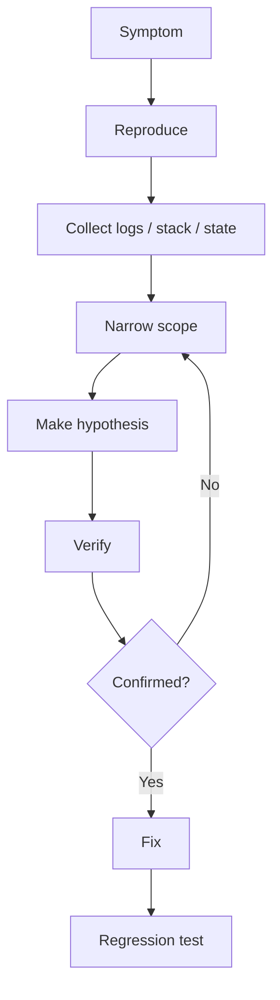

调试能力决定了遇到问题时能不能快速定位原因。代码能跑只是开始，能解释为什么这样跑，才是真正进入工程开发。

iOS 调试可以分成五类：逻辑调试、界面调试、内存调试、性能调试、崩溃分析。

## 1. 断点

最常用的是普通断点。它能让程序停在某一行，查看变量、调用栈和对象状态。

```objc
- (void)loginButtonTapped {
    NSString *account = self.accountTextField.text;
    NSString *password = self.passwordTextField.text;

    [self.service loginWithAccount:account password:password completion:^(NSError *error) {
        NSLog(@"login finished");
    }];
}
```

在 `loginWithAccount` 前打断点，可以检查账号、密码是否正确传入。

## 2. 条件断点

条件断点适合只在特定情况暂停。

例如列表有 1000 条数据，只想在第 500 条时停下，可以给断点添加条件：

```objc
indexPath.row == 500
```

这样不会每次循环都停。

## 3. 符号断点

符号断点可以在某个方法或函数被调用时暂停。

常用符号：

- `-[UIViewController viewDidLoad]`
- `objc_exception_throw`
- `-[UIViewController dealloc]`

`objc_exception_throw` 很常用，它能在异常抛出的第一时间停住，而不是等 App 崩溃后再看结果。

## 4. LLDB

LLDB 是 Xcode 底部调试控制台背后的调试器。

常用命令：

```lldb
po self
po self.view
p indexPath.row
bt
expr self.view.backgroundColor = [UIColor redColor]
```

含义：

- `po`：打印对象描述。
- `p`：打印基础变量。
- `bt`：查看调用栈。
- `expr`：执行表达式。

调试时能熟练使用 LLDB，会比只看日志高效很多。

## 5. Console 日志

日志适合观察流程，但不能滥用。

```objc
NSLog(@"request start: %@", url);
NSLog(@"request success: %@", responseObject);
NSLog(@"request failed: %@", error);
```

有效日志应该包含上下文，比如请求地址、参数、错误码、业务 id。只有“来了”“走了”这类日志，后期排查价值很低。

## 6. View Debugger

View Debugger 用来检查界面层级。

适合排查：

- 视图被遮挡。
- 约束异常。
- Cell 内容不显示。
- 点击区域和视觉区域不一致。
- 页面层级过深。

如果一个按钮看得见但点不到，View Debugger 往往比盲猜代码更快。

## 7. Memory Graph

Memory Graph 用来查看对象引用关系，尤其适合查循环引用。

典型问题：

```objc
self.completion = ^{
    [self reloadData];
};
```

如果 `self` 强持有 `completion`，Block 又强持有 `self`，就形成循环引用。

修复方式：

```objc
__weak typeof(self) weakSelf = self;
self.completion = ^{
    __strong typeof(weakSelf) self = weakSelf;
    if (!self) {
        return;
    }

    [self reloadData];
};
```

Memory Graph 的重点是看“为什么对象没有释放”，不是只看对象数量。

## 8. Instruments

Instruments 用来做性能和内存分析。

常用工具：

- Time Profiler：分析 CPU 耗时。
- Allocations：观察内存分配。
- Leaks：检查内存泄漏。
- Network：观察网络请求。
- Core Animation：分析渲染和掉帧。

卡顿排查通常先用 Time Profiler，看主线程时间花在哪里。

## 9. Crash Log

Crash Log 需要关注：

- Exception Type：异常类型。
- Termination Reason：终止原因。
- Crashed Thread：崩溃线程。
- Last Exception Backtrace：异常调用栈。
- Binary Images：符号化所需镜像信息。

常见崩溃类型：

- 数组越界。
- 字典插入 `nil`。
- 发送消息给已释放对象。
- 强制解包或类型转换错误。
- 主线程卡死被系统杀掉。

Objective-C 数组越界示例：

```objc
NSArray *items = @[@"A"];
NSString *value = items[2];
NSLog(@"%@", value);
```

安全访问：

```objc
- (id)safeObjectAtIndex:(NSUInteger)index inArray:(NSArray *)array {
    if (index >= array.count) {
        return nil;
    }
    return array[index];
}
```

## 10. 崩溃符号化

线上 Crash Log 通常是地址，需要 dSYM 符号化后才能看到方法名和行号。

需要保留：

- 发布版本的 `.app`。
- 对应版本的 `.dSYM`。
- 构建号和版本号。

如果 dSYM 丢失，线上崩溃会很难还原到具体代码。

## 11. 调试思路

调试时不要只改代码试运气。更稳定的路径是：

1. 复现问题。
2. 缩小范围。
3. 观察输入和输出。
4. 确认调用链。
5. 验证假设。
6. 再修改代码。

例如一个页面数据为空，要依次确认：

- 接口是否发出。
- 接口是否成功。
- JSON 是否解析成功。
- Model 是否有值。
- 数据源是否更新。
- UI 是否在主线程刷新。

## 12. 调试不是猜，而是建立证据链

成熟的调试过程应该形成证据链：



不要在没有证据时连续改代码。改到“看起来好了”但不知道为什么，是下一次线上事故的来源。

## 13. 崩溃分析路径

看到崩溃先分层：

- Objective-C 异常：数组越界、字典插入 nil、KVC key 错误。
- Mach 异常：野指针、内存访问错误、栈溢出。
- Watchdog：主线程卡死或启动太慢。
- OOM：内存过高被系统杀死。

Objective-C 异常通常能看到 `Last Exception Backtrace`。野指针可能只看到 `EXC_BAD_ACCESS`。

数组越界示例：

```objc
- (NSString *)titleAtIndex:(NSUInteger)index {
    return self.titles[index];
}
```

防御写法：

```objc
- (nullable NSString *)titleAtIndex:(NSUInteger)index {
    if (index >= self.titles.count) {
        return nil;
    }
    return self.titles[index];
}
```

防御不是让错误沉默。关键路径可以记录异常数据，帮助定位调用方为什么传了非法 index。

## 14. EXC_BAD_ACCESS 怎么查

`EXC_BAD_ACCESS` 表示访问了不该访问的内存。常见原因：

- 对象已释放后继续访问。
- C 指针越界。
- Core Foundation 对象桥接所有权错误。
- 多线程同时修改对象导致内存破坏。

排查工具：

- Address Sanitizer。
- Zombie Objects。
- Thread Sanitizer。
- Memory Graph。

Zombie 适合查“给已释放对象发消息”。开启后对象释放时不会立即回收，而是变成 Zombie，收到消息时能告诉你是哪类对象。

注意：Zombie 会让内存不释放，只能调试时打开。

## 15. 卡顿分析

卡顿要看主线程在做什么。常见原因：

- 主线程同步网络或文件 IO。
- 大量 JSON 解析。
- 图片解码。
- 复杂 Auto Layout。
- 滚动时频繁创建对象。
- 主线程等待锁。

Time Profiler 里重点看：

- Main Thread。
- 耗时最多的调用栈。
- 是否有系统调用阻塞。
- 是否有自己的方法反复出现。

主线程卡顿示例：

```objc
- (void)tableView:(UITableView *)tableView willDisplayCell:(UITableViewCell *)cell forRowAtIndexPath:(NSIndexPath *)indexPath {
    NSData *data = [NSData dataWithContentsOfURL:self.imageURLs[indexPath.row]];
    cell.imageView.image = [UIImage imageWithData:data];
}
```

这会在滚动时同步下载图片。修复方向是异步下载、缓存、复用校验和后台解码。

## 16. 内存泄漏和内存增长不是一回事

内存泄漏：对象已经不需要，但仍被强引用。

内存增长：对象可能仍有引用，可能是缓存，也可能是业务确实持有。

常见循环引用：

```objc
@property (nonatomic, copy) void (^completion)(void);

self.completion = ^{
    [self reloadData];
};
```

修复：

```objc
__weak typeof(self) weakSelf = self;
self.completion = ^{
    __strong typeof(weakSelf) self = weakSelf;
    if (!self) {
        return;
    }

    [self reloadData];
};
```

Memory Graph 要沿引用链看谁持有了谁，不要只看到对象没释放就下结论。

## 17. 线上日志设计

线上问题不能靠 Xcode 断点。需要有足够日志：

- 请求 URL 和业务 code。
- 关键参数的脱敏版本。
- 页面进入和离开。
- 登录态变化。
- 缓存命中和过期。
- 关键异常和错误码。

不要记录：

- Token。
- 密码。
- 完整身份证、手机号等敏感信息。
- 用户输入的隐私内容。

日志要能串起来，最好带 request id 或 trace id。

## 18. LLDB 高价值命令

除了 `po`，还应该掌握：

```lldb
bt
frame variable
expression self.view.backgroundColor = [UIColor redColor]
breakpoint set -n objc_exception_throw
thread backtrace all
```

`thread backtrace all` 对卡死很有用，可以看到所有线程在等什么。

## 19. Swift 混编提示

混编项目调试时要注意栈里可能同时出现 Swift 和 Objective-C。

- Swift Optional 崩溃可能来自 Objective-C 传入了未标注的 nil。
- Objective-C Block 循环引用在 Swift closure 中同样存在。
- Swift 异步任务回调 Objective-C UI 时仍要回主线程。
- dSYM 必须覆盖 Swift 和 Objective-C 产物，否则符号化不完整。

Objective-C API 的 Nullability 会直接影响 Swift 调试体验。类型越明确，崩溃越早在编译期暴露。

## 20. 掌握标准

掌握调试，需要能做到：

- 能使用普通断点、条件断点、符号断点。
- 能用 LLDB 查看对象、变量和调用栈。
- 能用 View Debugger 分析界面层级。
- 能用 Memory Graph 查循环引用。
- 能用 Instruments 观察性能和内存。
- 能阅读 Crash Log 的核心字段。
- 能理解 dSYM 对线上崩溃分析的重要性。
- 能按证据一步步缩小问题范围。
