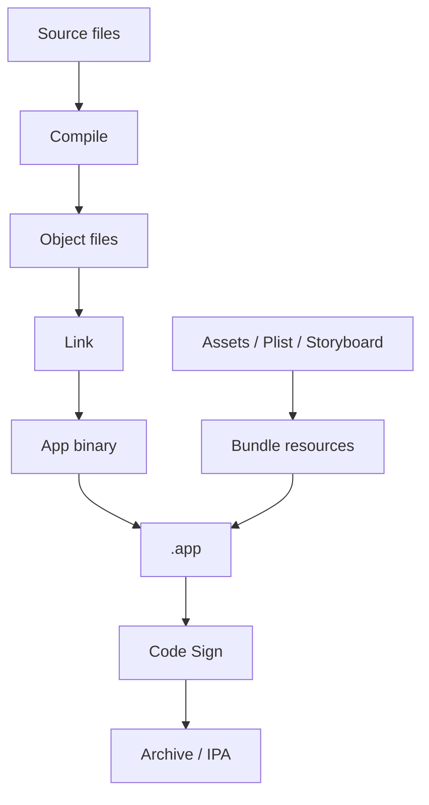

工程化解决的是项目如何被组织、构建、依赖、调试、打包和发布。它决定了一个 App 能不能稳定地从开发走到上线。

个人学习阶段也应该理解工程化，因为很多问题不是代码逻辑错误，而是配置、依赖、证书、构建环境错误。

## 1. Project 与 Workspace

`Project` 是 Xcode 工程本身，包含源码、资源、Target、Build Settings 等。

`Workspace` 可以包含多个 Project。使用 CocoaPods 后，通常会打开 `.xcworkspace`，因为它同时包含 App 工程和 Pods 工程。

常见错误是装了 CocoaPods 却继续打开 `.xcodeproj`，导致依赖找不到。

## 2. Target

Target 表示一个构建产物。

常见 Target：

- App Target：主 App。
- Unit Test Target：单元测试。
- UI Test Target：界面测试。
- Extension Target：通知扩展、分享扩展等。
- Framework Target：库。

Target 会决定：

- 编译哪些文件。
- 使用哪些资源。
- 生成什么产物。
- 使用哪些 Build Settings。
- 绑定哪些证书和 Bundle Identifier。

## 3. Scheme

Scheme 描述一次运行或打包使用哪个 Target、哪个配置、哪些测试。

常见用途：

- Debug Scheme：开发调试。
- Release Scheme：发布构建。
- Staging Scheme：测试环境。

如果项目区分开发、测试、生产环境，通常会通过 Scheme 或 Build Configuration 管理。

## 4. Build Configuration

常见配置：

- Debug：调试版本，日志多，优化少。
- Release：发布版本，优化多，调试信息少。

可以用宏区分环境：

```objc
#ifdef DEBUG
static NSString * const YWBaseURL = @"https://api-dev.example.com";
#else
static NSString * const YWBaseURL = @"https://api.example.com";
#endif
```

注意：环境配置要集中管理，不要让接口地址散落在各个文件里。

## 5. Build Settings

Build Settings 控制编译和链接行为。

常见配置：

- `PRODUCT_BUNDLE_IDENTIFIER`：Bundle ID。
- `IPHONEOS_DEPLOYMENT_TARGET`：最低系统版本。
- `HEADER_SEARCH_PATHS`：头文件搜索路径。
- `LIBRARY_SEARCH_PATHS`：库搜索路径。
- `OTHER_LDFLAGS`：链接参数。
- `SWIFT_VERSION`：Swift 版本。

很多“本地能跑、别人不能跑”的问题都和 Build Settings 或本地路径有关。

## 6. Info.plist

`Info.plist` 描述 App 的基础信息和系统能力声明。

常见内容：

- Bundle Display Name。
- Bundle Identifier。
- URL Schemes。
- 权限说明文案。
- 支持的方向。
- App Transport Security 配置。

权限文案示例：

```xml
<key>NSCameraUsageDescription</key>
<string>需要使用相机拍摄头像</string>
```

如果使用相机但没有配置权限说明，App 会崩溃。

## 7. 资源管理

资源包括图片、颜色、字体、Storyboard、Xib、JSON 文件等。

常见注意点：

- 图片放进 Assets，命名清晰。
- 不再使用的资源及时清理。
- 字体文件需要同时加入工程和 Info.plist。
- 大文件不要随意打进 App 包。
- 多语言文案不要写死在代码里。

资源问题常常不会编译报错，而是在运行时才表现为图片为空、字体不生效、文件找不到。

## 8. 依赖管理

常见依赖管理方式：

- CocoaPods。
- Swift Package Manager。
- 手动引入 Framework。
- Git Submodule。

CocoaPods 常用命令：

```bash
pod install
pod update
```

`pod install` 按照 `Podfile.lock` 安装，适合日常协作。`pod update` 会尝试更新版本，影响更大。

SPM 集成在 Xcode 里，适合 Swift 包和现代库管理。

## 9. 静态库与动态库

静态库会在链接时合入最终可执行文件。动态库在运行时加载。

简单理解：

- 静态库：打包进 App，启动时少一层动态加载。
- 动态库：模块独立，但会带来加载和签名管理问题。

iOS 项目中使用三方库时，不一定要一开始深入二进制细节，但要知道链接错误通常和库、符号、架构有关。

## 10. 证书与签名

iOS App 必须经过签名才能安装到真机或发布。

核心概念：

- Certificate：证明开发者身份。
- App ID：标识 App。
- Provisioning Profile：把证书、设备、App ID 绑定在一起。
- Entitlements：声明 App 能使用哪些系统能力。

常见问题：

- Bundle ID 不匹配。
- Profile 过期。
- 设备没有加入开发 Profile。
- Capability 开了但 Profile 未更新。

## 11. 打包与发布

发布链路通常是：

1. 选择 Release 配置。
2. Archive。
3. 上传 App Store Connect。
4. TestFlight 测试。
5. 提交审核。
6. 发布。

发布前要检查：

- 版本号和构建号。
- dSYM 是否上传。
- 隐私权限文案。
- 图标和启动图。
- 第三方 SDK 合规。
- 崩溃和核心流程测试。

## 12. 构建链路要从源码走到产物

工程化的核心链路是：



理解这条链路后，很多错误能快速归类：

- 语法报错：编译阶段。
- 找不到符号：链接阶段。
- 图片找不到：资源打包阶段。
- 真机安装失败：签名阶段。
- 上传失败：归档或 App Store Connect 阶段。

## 13. Build Settings 的排查方法

Build Settings 不要靠记忆，要会查。

常见排查路径：

1. 确认当前选中的 Target。
2. 确认当前 Scheme 使用的 Configuration。
3. 搜索具体配置项。
4. 看配置来自 project、target 还是 xcconfig。
5. 检查 Debug 和 Release 是否不同。

例如链接错误：

```text
Undefined symbols for architecture arm64
```

可能原因：

- 源文件没有加入 Target Membership。
- 静态库没有链接。
- `Other Linker Flags` 缺少参数。
- C++/Objective-C++ 混编没有正确处理。
- 模拟器和真机架构不匹配。

排查时先定位是“编译不到”还是“链接不到”。

## 14. xcconfig

当环境配置越来越多时，使用 `.xcconfig` 比在 Xcode UI 里手点更可控。

示例：

```text
API_BASE_URL = https://api-dev.example.com
PRODUCT_BUNDLE_IDENTIFIER = com.yawzhang.blog.dev
```

代码里可以通过 `Info.plist` 注入读取：

```objc
NSString *baseURL = [[NSBundle mainBundle] objectForInfoDictionaryKey:@"APIBaseURL"];
```

好处：

- 配置可版本管理。
- Debug / Release 差异清楚。
- CI 更容易覆盖。
- 减少本地 Xcode 配置漂移。

## 15. 依赖版本锁定

依赖管理最怕“我这能跑，你那不能跑”。

CocoaPods 的 `Podfile.lock` 必须提交。它锁定实际安装版本。

```text
Podfile      描述希望使用的依赖范围
Podfile.lock 记录当前实际解析出的版本
```

日常协作优先使用：

```bash
pod install
```

谨慎使用：

```bash
pod update
```

`pod update` 会更新符合约束的依赖版本，可能引入行为变化。

## 16. CI 构建

CI 的价值是让构建不依赖某个人的电脑。

基础 CI 应至少做：

- 拉取代码。
- 安装依赖。
- 编译 Debug。
- 编译 Release 或 Archive。
- 跑单元测试。
- 导出构建日志。

常见失败原因：

- 本地没提交资源文件。
- 依赖版本未锁定。
- 证书或 Profile 缺失。
- 脚本依赖本机路径。
- Build Settings 写了绝对路径。

工程化成熟的一个标志：换一台干净机器也能按文档构建成功。

## 17. 多环境配置

开发、测试、预发、生产环境通常有不同：

- Base URL。
- Bundle ID。
- App 名称。
- 图标。
- 推送环境。
- 第三方 SDK Key。

不要在代码中到处写：

```objc
// Bad
NSString *url = @"https://api-dev.example.com";
```

应该集中配置：

```objc
@interface YWEnvironment : NSObject

@property (nonatomic, copy, readonly) NSURL *baseURL;
@property (nonatomic, assign, readonly, getter=isProduction) BOOL production;

+ (instancetype)currentEnvironment;

@end
```

所有业务从环境对象读取配置。

## 18. 发布前检查

发布不是点 Archive。至少要确认：

- 版本号和构建号递增。
- Release 环境指向生产。
- 推送证书和环境正确。
- dSYM 已保留并上传。
- 隐私权限文案完整。
- 第三方 SDK 合规。
- 核心路径已回归。
- 灰度或 TestFlight 验证完成。

线上排查依赖 dSYM，丢失 dSYM 等于丢失崩溃定位能力。

## 19. Swift 混编提示

混编工程里，工程化还要关注：

- Swift 版本。
- `Defines Module`。
- Bridging Header 路径。
- `ProjectName-Swift.h` 生成。
- 模块之间是否循环依赖。
- Swift Package 与 CocoaPods 同时存在时的构建顺序。

Objective-C 引入 Swift 头文件时，不要在公共 `.h` 里随意 import `ProjectName-Swift.h`，容易造成循环依赖和编译膨胀。优先在 `.m` 中引入。

## 20. 掌握标准

掌握工程化，需要能做到：

- 能区分 Project、Workspace、Target、Scheme。
- 能理解 Debug 和 Release 的区别。
- 能定位常见 Build Settings 问题。
- 能配置基础权限和 Info.plist。
- 能正确使用 CocoaPods 或 SPM。
- 能理解静态库、动态库和链接错误的大致关系。
- 能解释证书、Profile、Bundle ID 的关系。
- 能完成基本打包、上传和 TestFlight 流程。
