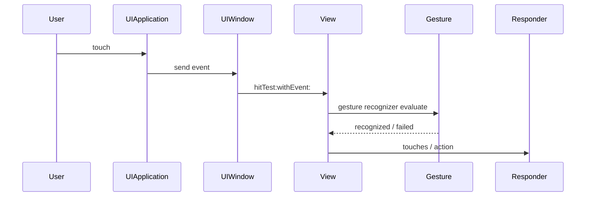

事件与交互描述用户操作如何进入 App，以及页面如何响应这些操作。点击、滑动、输入、返回、传值、键盘弹出，本质上都是事件流。

## 1. Target-Action

按钮点击最常见的是 Target-Action。

```objc
[button addTarget:self
           action:@selector(handleLoginButtonTap:)
 forControlEvents:UIControlEventTouchUpInside];

- (void)handleLoginButtonTap:(UIButton *)sender {
    NSLog(@"tap");
}
```

Target 是接收事件的对象，Action 是被调用的方法，Control Event 是触发时机。它适合一对一、明确的控件事件。

## 2. Delegate

Delegate 用来把对象内部发生的事件交给外部处理。它适合一对一回调。

```objc
@interface LoginView : UIView
@property (nonatomic, weak) id<LoginViewDelegate> delegate;
@end

@protocol LoginViewDelegate <NSObject>
- (void)loginViewDidTapSubmit:(LoginView *)view;
@end
```

Delegate 通常用 `weak`，避免 view 和 controller 互相强持有。

## 3. Block 回调

Block 适合轻量回调，尤其是异步结果。

```objc
self.onSubmit = ^{
    NSLog(@"submit");
};
```

使用 Block 要注意循环引用：

```objc
__weak typeof(self) weakSelf = self;
self.onSubmit = ^{
    __strong typeof(weakSelf) self = weakSelf;
    [self submit];
};
```

Block 适合局部事件，不适合把复杂业务链路都塞进闭包。

## 4. 手势识别

`UIGestureRecognizer` 用来处理点击、滑动、长按、缩放等手势。

```objc
UITapGestureRecognizer *tap = [[UITapGestureRecognizer alloc] initWithTarget:self action:@selector(handleTap:)];
[self.view addGestureRecognizer:tap];

- (void)handleTap:(UITapGestureRecognizer *)gesture {
    CGPoint point = [gesture locationInView:self.view];
    NSLog(@"%@", NSStringFromCGPoint(point));
}
```

常见手势包括：

- `UITapGestureRecognizer`
- `UIPanGestureRecognizer`
- `UILongPressGestureRecognizer`
- `UIPinchGestureRecognizer`
- `UISwipeGestureRecognizer`

手势冲突是常见问题，比如 scroll view 内部手势和自定义手势同时存在时，需要通过 delegate 协调。

## 5. Responder Chain

Responder Chain 是事件传递链。`UIView`、`UIViewController`、`UIWindow`、`UIApplication` 都可以是 responder。

当一个 view 不处理事件时，事件会沿响应链向上传递。

```objc
- (void)touchesBegan:(NSSet<UITouch *> *)touches withEvent:(UIEvent *)event {
    [super touchesBegan:touches withEvent:event];
}
```

日常开发不常直接重写触摸方法，但理解响应链有助于处理键盘、菜单、手势冲突和事件无法响应的问题。

## 6. 键盘处理

输入页面必须处理键盘遮挡。

```objc
[[NSNotificationCenter defaultCenter] addObserver:self
                                         selector:@selector(handleKeyboardWillShow:)
                                             name:UIKeyboardWillShowNotification
                                           object:nil];

- (void)handleKeyboardWillShow:(NSNotification *)notification {
    CGRect frame = [notification.userInfo[UIKeyboardFrameEndUserInfoKey] CGRectValue];
    NSTimeInterval duration = [notification.userInfo[UIKeyboardAnimationDurationUserInfoKey] doubleValue];
}
```

键盘处理重点：

- 获取键盘最终 frame。
- 跟随键盘动画时间调整布局。
- 页面消失时移除监听。
- 滚动容器使用 `contentInset` 更自然。

## 7. 页面跳转

页面跳转常见方式有 push 和 present。

```objc
DetailViewController *detail = [[DetailViewController alloc] init];
[self.navigationController pushViewController:detail animated:YES];
```

```objc
LoginViewController *login = [[LoginViewController alloc] init];
[self presentViewController:login animated:YES completion:nil];
```

push 表示进入导航栈下一层；present 表示模态展示。两者生命周期表现不同，不应混用。

## 8. 页面传值

正向传值通常通过属性或初始化方法。

```objc
DetailViewController *detail = [[DetailViewController alloc] init];
detail.articleId = article.articleId;
[self.navigationController pushViewController:detail animated:YES];
```

反向传值可以用 delegate、block 或通知。

```objc
detail.onUpdate = ^(NSString *value) {
    NSLog(@"%@", value);
};
```

简单页面可以直接传值；复杂业务更适合通过状态管理、ViewModel 或路由参数统一处理。

## 9. 交互设计边界

交互代码容易膨胀。判断逻辑放在哪里，可以看职责：

- 控件事件：View 或 Controller 接收。
- 页面跳转：Controller 或 Router。
- 数据请求：Service。
- 状态转换：ViewModel。
- 埋点：Tracker。

Controller 可以协调，但不应承载所有细节。

## 10. 事件系统的完整链路

触摸事件不是直接发送给按钮方法。系统会先命中测试，找到最合适的 View，再沿响应链处理。



这条链路解释了：

- 为什么 View 被覆盖后点不到。
- 为什么 `userInteractionEnabled = NO` 会阻断事件。
- 为什么手势可能影响按钮点击。
- 为什么响应链可以让事件向上传递。

## 11. Hit Testing

`hitTest:withEvent:` 用来寻找触摸点落在哪个 View 上。

系统大致判断：

1. View 是否隐藏。
2. View 是否允许交互。
3. alpha 是否足够可见。
4. 点是否在 View bounds 内。
5. 从后往前递归检查子视图。

扩大按钮点击区域可以重写 `pointInside:withEvent:`：

```objc
@implementation YWExpandedButton

- (BOOL)pointInside:(CGPoint)point withEvent:(UIEvent *)event {
    CGFloat inset = -12.0;
    CGRect largerBounds = CGRectInset(self.bounds, inset, inset);
    return CGRectContainsPoint(largerBounds, point);
}

@end
```

这比在按钮外面套透明 View 更清晰。

## 12. Target-Action 的边界

Target-Action 适合单个控件触发明确动作。

```objc
[self.submitButton addTarget:self
                      action:@selector(submitButtonTapped:)
            forControlEvents:UIControlEventTouchUpInside];
```

它不适合承载复杂业务。按钮点击后应该尽快转交给业务方法：

```objc
- (void)submitButtonTapped:(UIButton *)sender {
    [self submitForm];
}

- (void)submitForm {
    if (![self validateInput]) {
        return;
    }

    [self.viewModel submit];
}
```

这样事件入口和业务流程分开，后续键盘 return、导航栏按钮、自动提交都可以复用 `submitForm`。

## 13. Delegate 为什么适合一对一

Delegate 表达的是“我发生了某件事，请我的代理决定怎么处理”。它天然适合一对一关系。

```objc
NS_ASSUME_NONNULL_BEGIN

@protocol YWLoginViewDelegate <NSObject>

- (void)loginViewDidTapSubmitWithAccount:(NSString *)account password:(NSString *)password;

@end

@interface YWLoginView : UIView

@property (nonatomic, weak, nullable) id<YWLoginViewDelegate> delegate;

@end

NS_ASSUME_NONNULL_END
```

Delegate 通常用 `weak`，避免 View 和 Controller 互相强持有。

```objc
- (void)submitButtonTapped {
    [self.delegate loginViewDidTapSubmitWithAccount:self.accountTextField.text ?: @""
                                           password:self.passwordTextField.text ?: @""];
}
```

如果一个事件需要通知多个对象，Delegate 就不合适，应该考虑通知、事件总线或状态订阅。

## 14. Gesture Recognizer 的冲突处理

手势冲突在复杂页面很常见，例如横向滑动 Cell、纵向滚动列表、返回手势同时存在。

常用代理方法：

```objc
- (BOOL)gestureRecognizer:(UIGestureRecognizer *)gestureRecognizer
shouldRecognizeSimultaneouslyWithGestureRecognizer:(UIGestureRecognizer *)otherGestureRecognizer {
    return YES;
}
```

也可以要求一个手势失败后另一个才识别：

```objc
[singleTapGesture requireGestureRecognizerToFail:doubleTapGesture];
```

处理手势冲突时要先明确优先级：哪个手势对用户意图更重要，哪个可以让步。

## 15. Responder Chain

响应链让事件可以从当前对象向上传递。

典型链路：

```text
UIView -> UIViewController -> UIWindow -> UIApplication
```

查找下一个响应者：

```objc
UIResponder *responder = self.nextResponder;
while (responder) {
    NSLog(@"%@", responder);
    responder = responder.nextResponder;
}
```

响应链适合处理菜单、键盘命令、未被子视图消费的事件。它不是替代 Delegate 的万能通信方式。

## 16. 键盘处理的工程细节

键盘弹出会改变可视区域。不要写死键盘高度，因为输入法、横竖屏、iPad 浮动键盘都会变化。

```objc
[[NSNotificationCenter defaultCenter] addObserver:self
                                         selector:@selector(keyboardWillChangeFrame:)
                                             name:UIKeyboardWillChangeFrameNotification
                                           object:nil];

- (void)keyboardWillChangeFrame:(NSNotification *)notification {
    NSDictionary *userInfo = notification.userInfo;
    CGRect endFrame = [userInfo[UIKeyboardFrameEndUserInfoKey] CGRectValue];
    NSTimeInterval duration = [userInfo[UIKeyboardAnimationDurationUserInfoKey] doubleValue];

    CGRect convertedFrame = [self.view convertRect:endFrame fromView:nil];
    CGFloat overlap = MAX(0, CGRectGetMaxY(self.view.bounds) - CGRectGetMinY(convertedFrame));

    self.bottomConstraint.constant = overlap;

    [UIView animateWithDuration:duration animations:^{
        [self.view layoutIfNeeded];
    }];
}
```

使用 `UIKeyboardWillChangeFrameNotification` 比只监听 show/hide 更完整，因为键盘高度可能变化。

## 17. 页面传值的方向

页面传值要区分正向传值和反向传值。

正向传值：创建下一个页面时注入依赖。

```objc
- (instancetype)initWithUserId:(NSString *)userId {
    self = [super initWithNibName:nil bundle:nil];
    if (self) {
        _userId = [userId copy];
    }
    return self;
}
```

反向传值：下一个页面完成操作后通知上一个页面。

```objc
@property (nonatomic, copy, nullable) void (^didSelectName)(NSString *name);
```

使用 Block 时注意循环引用：

```objc
__weak typeof(self) weakSelf = self;
controller.didSelectName = ^(NSString *name) {
    __strong typeof(weakSelf) self = weakSelf;
    if (!self) {
        return;
    }

    self.nameLabel.text = name;
};
```

## 18. Swift 混编提示

Objective-C Delegate 给 Swift 使用时，协议应标注清楚空值，并尽量避免可选协议方法过多。

```objc
NS_ASSUME_NONNULL_BEGIN

@protocol YWPickerViewDelegate <NSObject>

- (void)pickerViewDidSelectItemWithIdentifier:(NSString *)identifier;

@end

NS_ASSUME_NONNULL_END
```

Swift 闭包回调到 Objective-C 时，要注意 escaping closure 的生命周期。能用一次性回调，就不要长期强持有。

## 19. 掌握标准

应当能做到：

- 理解 Target-Action、Delegate、Block 的适用边界。
- 能处理常见手势和手势冲突。
- 理解 Responder Chain 的基本方向。
- 能处理键盘遮挡和输入页面布局变化。
- 能完成页面跳转和页面传值。
- 能把交互逻辑拆到合适的模块。

事件与交互是页面“活起来”的部分。它的难点不是 API，而是事件流是否清楚、职责是否边界明确。
