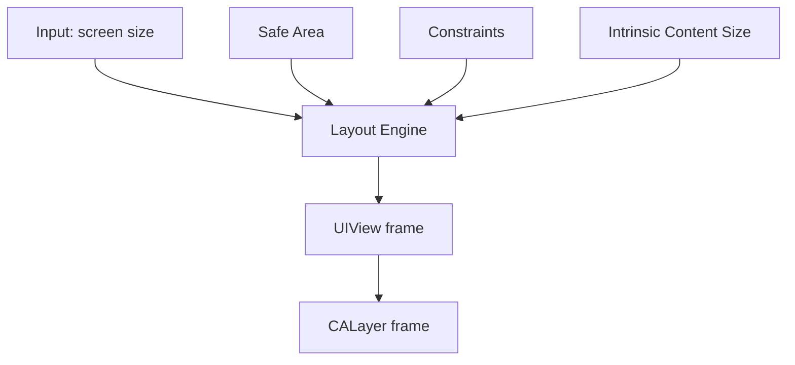

布局解决的是一个问题：视图应该出现在什么位置，占据多大空间，并且在不同设备、方向、字体和系统环境下保持稳定。

## 1. Frame 布局

Frame 是最直接的布局方式。它用 `x`、`y`、`width`、`height` 描述视图的位置和尺寸。

```objc
UIView *box = [[UIView alloc] initWithFrame:CGRectMake(20, 100, 200, 80)];
box.backgroundColor = UIColor.systemBlueColor;
[self.view addSubview:box];
```

Frame 适合简单、固定、计算明确的布局。它的问题是设备变化后需要手动重新计算。

```objc
- (void)viewDidLayoutSubviews {
    [super viewDidLayoutSubviews];
    self.button.frame = CGRectMake(20, self.view.bounds.size.height - 80, self.view.bounds.size.width - 40, 48);
}
```

如果使用 Frame，通常要在 `viewDidLayoutSubviews` 或 `layoutSubviews` 中根据当前尺寸计算，而不是只在初始化时写死。

## 2. Bounds 和 Center

`frame` 描述视图在父视图坐标系中的位置和尺寸，`bounds` 描述视图自己的内部坐标系，`center` 描述中心点。

```objc
view.frame = CGRectMake(20, 100, 200, 80);
view.center = CGPointMake(160, 200);
```

普通页面布局主要用 `frame`。涉及滚动、绘制、transform 时，`bounds` 和 `center` 会更重要。

## 3. Auto Layout

Auto Layout 用约束描述视图之间的关系，而不是直接写死坐标。

```objc
UIView *box = [[UIView alloc] init];
box.translatesAutoresizingMaskIntoConstraints = NO;
[self.view addSubview:box];

[NSLayoutConstraint activateConstraints:@[
    [box.leadingAnchor constraintEqualToAnchor:self.view.leadingAnchor constant:20],
    [box.trailingAnchor constraintEqualToAnchor:self.view.trailingAnchor constant:-20],
    [box.topAnchor constraintEqualToAnchor:self.view.safeAreaLayoutGuide.topAnchor constant:20],
    [box.heightAnchor constraintEqualToConstant:80]
]];
```

`translatesAutoresizingMaskIntoConstraints = NO` 很关键。纯代码 Auto Layout 中，如果忘记关掉它，系统会把 autoresizing mask 转成约束，容易产生冲突。

## 4. Safe Area

Safe Area 表示不被刘海、状态栏、Home Indicator、导航栏等遮挡的安全区域。

```objc
[button.bottomAnchor constraintEqualToAnchor:self.view.safeAreaLayoutGuide.bottomAnchor constant:-20].active = YES;
```

底部按钮、顶部内容、全屏页面都应该考虑 Safe Area。不要简单用屏幕高度减固定值处理所有机型。

## 5. Stack View

`UIStackView` 用于线性排列子视图，可以减少大量约束代码。

```objc
UIStackView *stack = [[UIStackView alloc] initWithArrangedSubviews:@[titleLabel, subtitleLabel, button]];
stack.axis = UILayoutConstraintAxisVertical;
stack.spacing = 12;
stack.alignment = UIStackViewAlignmentFill;
stack.distribution = UIStackViewDistributionFill;
```

Stack View 适合表单、纵向信息块、按钮组。复杂网格和高度动态列表不应强行用 Stack View 堆。

## 6. 内容优先级

Auto Layout 中，两个优先级很重要：

- Content Hugging：不想被拉大。
- Compression Resistance：不想被压缩。

```objc
[titleLabel setContentCompressionResistancePriority:UILayoutPriorityRequired forAxis:UILayoutConstraintAxisHorizontal];
[subtitleLabel setContentHuggingPriority:UILayoutPriorityDefaultLow forAxis:UILayoutConstraintAxisHorizontal];
```

当两个 label 横向排列、空间不足时，优先级决定谁被压缩。复杂页面布局问题很多不是约束数量不够，而是优先级没表达清楚。

## 7. 动态高度

列表 cell 常常需要动态高度。核心是让内容约束从顶部贯穿到底部。

```objc
tableView.estimatedRowHeight = 80;
tableView.rowHeight = UITableViewAutomaticDimension;
```

同时 cell 内部要有完整约束。比如最后一个 label 必须约束到底部，否则系统无法推导 cell 高度。

## 8. 横竖屏和尺寸变化

布局不能只考虑一种屏幕。横竖屏、分屏、动态字体、iPad 多窗口都会改变可用空间。

```objc
- (void)viewWillTransitionToSize:(CGSize)size
       withTransitionCoordinator:(id<UIViewControllerTransitionCoordinator>)coordinator {
    [super viewWillTransitionToSize:size withTransitionCoordinator:coordinator];
}
```

大部分适配应交给 Auto Layout，只有在布局策略真正变化时才写额外逻辑。

## 9. 暗色模式与视觉适配

布局不只是位置，也包括视觉环境。颜色应优先使用动态颜色。

```objc
self.view.backgroundColor = UIColor.systemBackgroundColor;
titleLabel.textColor = UIColor.labelColor;
```

不要把所有颜色写死为黑白。系统动态颜色能自动适配亮色和暗色模式。

## 10. 布局系统的本质：把约束求解成 frame

布局不是“把控件放到某个位置”，而是把父子视图、屏幕尺寸、安全区域、内容大小、优先级这些条件求解成最终 frame。

无论使用 Frame、Auto Layout、Stack View，最终 UIKit 都要得到每个 View 的：

- `origin.x`
- `origin.y`
- `width`
- `height`



理解这一点后，很多布局问题会变清楚：Auto Layout 不是替代 frame，而是用约束计算 frame。

## 11. Frame 布局适合什么

Frame 布局直接、可控、性能开销低，适合：

- 简单固定布局。
- 高性能列表 Cell。
- 自定义绘制组件。
- 动画过程中需要直接修改位置。

示例：

```objc
- (void)layoutSubviews {
    [super layoutSubviews];

    CGFloat padding = 16.0;
    CGFloat avatarSize = 48.0;

    self.avatarImageView.frame = CGRectMake(padding, padding, avatarSize, avatarSize);

    CGFloat titleX = CGRectGetMaxX(self.avatarImageView.frame) + 12.0;
    CGFloat titleWidth = CGRectGetWidth(self.bounds) - titleX - padding;
    self.titleLabel.frame = CGRectMake(titleX, padding, titleWidth, 24.0);
}
```

`layoutSubviews` 里使用 `self.bounds`，不要过早依赖初始化时的尺寸。初始化时 View 的尺寸经常还没确定。

## 12. Auto Layout 解决什么问题

Auto Layout 适合尺寸变化多、内容动态、需要适配多设备的界面。

它通过约束描述关系：

```objc
self.titleLabel.translatesAutoresizingMaskIntoConstraints = NO;

[NSLayoutConstraint activateConstraints:@[
    [self.titleLabel.leadingAnchor constraintEqualToAnchor:self.contentView.leadingAnchor constant:16.0],
    [self.titleLabel.trailingAnchor constraintEqualToAnchor:self.contentView.trailingAnchor constant:-16.0],
    [self.titleLabel.topAnchor constraintEqualToAnchor:self.contentView.topAnchor constant:12.0]
]];
```

`translatesAutoresizingMaskIntoConstraints = NO` 很关键。代码创建 View 时，如果不关闭 autoresizing mask 转约束，可能产生额外约束冲突。

## 13. 约束冲突怎么读

控制台出现 `Unable to simultaneously satisfy constraints` 时，不要只看最后一行。要找三件事：

- 哪些约束互相冲突。
- 哪个 View 的尺寸或位置无法同时满足。
- 系统最终打破了哪条约束。

典型冲突：固定宽度 + 左右边距 + 父视图宽度不足。

```objc
[NSLayoutConstraint activateConstraints:@[
    [button.leadingAnchor constraintEqualToAnchor:self.view.leadingAnchor constant:20.0],
    [button.trailingAnchor constraintEqualToAnchor:self.view.trailingAnchor constant:-20.0],
    [button.widthAnchor constraintEqualToConstant:400.0]
]];
```

小屏幕上父视图宽度不足时，左右边距和固定宽度不能同时成立。

解决思路不是随便删约束，而是明确布局意图：

- 如果按钮应该自适应宽度，删除固定宽度。
- 如果按钮必须 400 宽，降低左右约束优先级或允许横向滚动。
- 如果小屏放不下，重新设计布局。

## 14. Intrinsic Content Size

`UILabel`、`UIButton`、`UIImageView` 等控件有内容固有尺寸。Auto Layout 可以根据文字、图片推导控件大小。

```objc
self.titleLabel.numberOfLines = 0;
self.titleLabel.text = @"一段可能换行的长文本";
```

多行 Label 常见要求：

```objc
[self.titleLabel setContentCompressionResistancePriority:UILayoutPriorityRequired
                                                 forAxis:UILayoutConstraintAxisVertical];
```

两个重要优先级：

- Hugging：不想被拉大。
- Compression Resistance：不想被压缩。

如果两个 Label 横向排列，空间不足时谁先被压缩，就由这些优先级决定。

## 15. 动态高度 Cell

动态高度 Cell 的关键不是手动算高度，而是让约束从顶部贯通到底部。

```objc
tableView.estimatedRowHeight = 80.0;
tableView.rowHeight = UITableViewAutomaticDimension;
```

Cell 内部需要完整约束：

```objc
[NSLayoutConstraint activateConstraints:@[
    [self.titleLabel.topAnchor constraintEqualToAnchor:self.contentView.topAnchor constant:12.0],
    [self.titleLabel.leadingAnchor constraintEqualToAnchor:self.contentView.leadingAnchor constant:16.0],
    [self.titleLabel.trailingAnchor constraintEqualToAnchor:self.contentView.trailingAnchor constant:-16.0],

    [self.summaryLabel.topAnchor constraintEqualToAnchor:self.titleLabel.bottomAnchor constant:8.0],
    [self.summaryLabel.leadingAnchor constraintEqualToAnchor:self.titleLabel.leadingAnchor],
    [self.summaryLabel.trailingAnchor constraintEqualToAnchor:self.titleLabel.trailingAnchor],
    [self.summaryLabel.bottomAnchor constraintEqualToAnchor:self.contentView.bottomAnchor constant:-12.0]
]];
```

如果缺少底部约束，系统无法知道 Cell 高度应该到哪里结束。

## 16. Safe Area 和滚动内容

刘海屏、底部 Home Indicator、导航栏、TabBar 都会影响可见区域。Safe Area 的意义是告诉你内容应该避开哪些系统区域。

```objc
[NSLayoutConstraint activateConstraints:@[
    [self.tableView.topAnchor constraintEqualToAnchor:self.view.safeAreaLayoutGuide.topAnchor],
    [self.tableView.leadingAnchor constraintEqualToAnchor:self.view.leadingAnchor],
    [self.tableView.trailingAnchor constraintEqualToAnchor:self.view.trailingAnchor],
    [self.tableView.bottomAnchor constraintEqualToAnchor:self.view.bottomAnchor]
]];
```

滚动视图还要区分两个布局对象：

- `contentLayoutGuide`：内容区域。
- `frameLayoutGuide`：可视区域。

```objc
[NSLayoutConstraint activateConstraints:@[
    [contentView.topAnchor constraintEqualToAnchor:scrollView.contentLayoutGuide.topAnchor],
    [contentView.leadingAnchor constraintEqualToAnchor:scrollView.contentLayoutGuide.leadingAnchor],
    [contentView.trailingAnchor constraintEqualToAnchor:scrollView.contentLayoutGuide.trailingAnchor],
    [contentView.bottomAnchor constraintEqualToAnchor:scrollView.contentLayoutGuide.bottomAnchor],

    [contentView.widthAnchor constraintEqualToAnchor:scrollView.frameLayoutGuide.widthAnchor]
]];
```

这能避免 ScrollView 内容尺寸不明确的问题。

## 17. 布局性能

Auto Layout 很强，但不是没有成本。列表 Cell 中大量复杂约束、频繁调用 `layoutIfNeeded`、重复增删约束都会影响性能。

优化方向：

- Cell 约束创建一次，不要在复用时反复创建。
- 状态变化时改 `constant`，不要重复 remove/add。
- 简单高频 UI 可以用 Frame。
- 避免在滚动过程中做大量文本计算。

```objc
@property (nonatomic, strong) NSLayoutConstraint *heightConstraint;

self.heightConstraint.constant = expanded ? 120.0 : 44.0;
[UIView animateWithDuration:0.25 animations:^{
    [self.view layoutIfNeeded];
}];
```

## 18. Swift 混编提示

Objective-C 自定义 View 给 Swift 使用时，布局 API 要暴露清楚，不要让 Swift 侧直接改内部约束。

```objc
NS_ASSUME_NONNULL_BEGIN

@interface YWExpandableView : UIView

@property (nonatomic, assign, getter=isExpanded) BOOL expanded;
- (void)setExpanded:(BOOL)expanded animated:(BOOL)animated;

@end

NS_ASSUME_NONNULL_END
```

Swift 侧只关心状态，不关心内部约束如何变化。

## 19. 布局掌握标准

应当能做到：

- 区分 `frame`、`bounds`、`center`。
- 能用 Auto Layout 写出稳定约束。
- 知道 Safe Area 的意义。
- 能使用 Stack View 简化线性布局。
- 能处理动态高度和屏幕适配。
- 能定位常见约束冲突和布局错位问题。

布局的核心不是记 API，而是把页面约束关系表达清楚。
