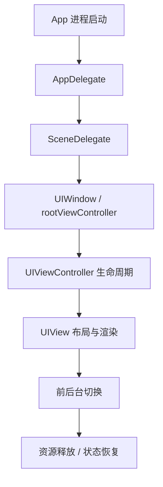
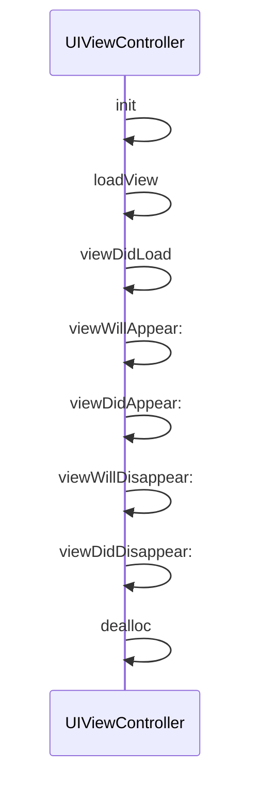
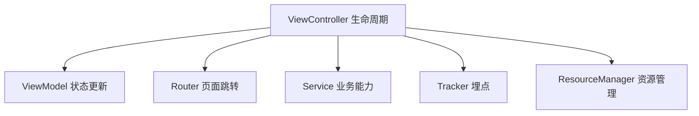
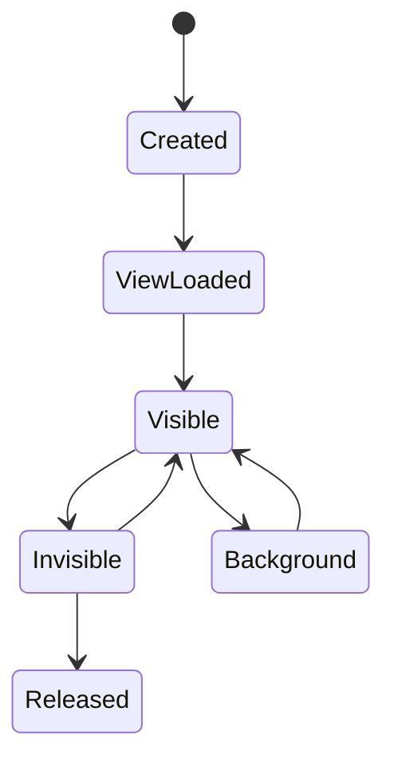

iOS 生命周期不是一组需要机械记忆的回调方法，而是一套贯穿 App 进程、Scene、Window、ViewController、View、资源释放和状态恢复的执行模型。

在实际开发中，生命周期主要回答三个问题：代码应该在哪个阶段执行，逻辑是否会被重复触发，对象和资源能否在正确的时机释放。页面重复请求、首屏卡顿、前后台切换状态异常、控制器无法释放，很多都可以回到这三个问题上定位。



## 1. App 生命周期：进程级状态管理

App 生命周期描述应用进程从启动、激活、失活、进入后台到重新回到前台的过程。它关注的是整个应用，而不是某一个页面。

常见节点包括：

- `application:didFinishLaunchingWithOptions:`：应用启动完成，适合初始化日志、崩溃采集、网络配置、路由、全局服务。
- `applicationWillResignActive:`：应用即将失去活跃状态，例如来电、锁屏、控制中心拉起。
- `applicationDidEnterBackground:`：应用进入后台，适合保存状态、暂停任务、释放可重建资源。
- `applicationWillEnterForeground:`：应用即将回到前台，适合准备刷新 UI 或业务状态。
- `applicationDidBecomeActive:`：应用重新变为可交互状态，适合恢复动画、检查敏感状态。

`AppDelegate` 不适合承载大量业务逻辑。更合理的方式是让它作为进程级事件入口，将启动、登录态、路由、数据同步等任务分发给独立模块。

## 2. Scene 生命周期：窗口级状态管理

从 iOS 13 开始，UIKit 引入 Scene 生命周期。App 进程和 UI 场景被拆分，一个 App 可以同时拥有多个 Scene。

`AppDelegate` 关注进程，`SceneDelegate` 关注某一个窗口场景。这个拆分在 iPad 多窗口、外接显示器、多 Scene 恢复等场景下尤其重要。

常见节点包括：

- `scene:willConnectToSession:options:`：连接 Scene，创建 `UIWindow`，配置根控制器。
- `sceneDidBecomeActive:`：当前 Scene 可交互。
- `sceneWillResignActive:`：当前 Scene 即将不可交互。
- `sceneDidEnterBackground:`：当前 Scene 进入后台。
- `sceneWillEnterForeground:`：当前 Scene 即将回到前台。

现代 iOS 项目中，窗口创建、根控制器配置、Scene 级状态恢复，应优先放在 `SceneDelegate` 中，而不是继续堆在 `AppDelegate`。

## 3. ViewController 生命周期：页面逻辑主线

`UIViewController` 生命周期描述页面从创建、加载 view、展示、消失到释放的过程。日常页面开发中，大部分生命周期问题都发生在这一层。

典型顺序如下：



职责边界可以这样划分：

- `init`：初始化数据，不访问 `self.view`。
- `loadView`：创建根 view，纯代码页面才常用。
- `viewDidLoad`：view 加载完成，适合一次性 UI 构建、约束设置、事件绑定。
- `viewWillAppear:`：页面每次即将出现，适合轻量刷新。
- `viewDidAppear:`：页面已经展示，适合曝光埋点、动画启动、首帧后操作。
- `viewWillDisappear:`：页面即将消失，适合暂停任务、停止计时器、取消请求。
- `viewDidDisappear:`：页面已经消失，适合状态收尾。
- `dealloc`：对象释放，适合确认资源解绑是否完整。

这里最重要的区别是：`viewDidLoad` 通常只执行一次，而 `viewWillAppear:` 和 `viewDidAppear:` 可能执行多次。

因此，一次性创建逻辑适合放在 `viewDidLoad`；每次页面重新出现都需要刷新的轻量逻辑，适合放在 `viewWillAppear:`；真正依赖页面可见状态的逻辑，适合放在 `viewDidAppear:`。

## 4. View 生命周期：布局与渲染

`UIViewController` 管理页面流程，`UIView` 负责显示、布局和绘制。

常见节点包括：

- `initWithFrame:` / `initWithCoder:`：view 初始化。
- `layoutSubviews`：子视图布局。
- `drawRect:`：自定义绘制。
- `didMoveToSuperview`：加入或移出父视图。
- `didMoveToWindow`：进入或离开窗口。

`layoutSubviews` 可能被频繁调用。旋转、约束变化、内容变化、父视图尺寸变化，都可能触发重新布局。

因此，`layoutSubviews` 适合处理布局，不适合做网络请求、埋点、对象重复创建或复杂业务计算。判断一段逻辑能否放在这里，一个简单标准是：重复执行多次是否仍然安全。

## 5. 前后台切换：状态恢复与资源管理

前后台切换经常暴露页面状态设计问题。

典型场景包括：

- 视频页进入后台后暂停播放。
- 支付页回到前台后查询订单状态。
- 聊天页回到前台后刷新未读数。
- 隐私页面进入后台后遮盖敏感信息。

页面可以监听系统通知：

```objc
#import <Foundation/Foundation.h>

NS_ASSUME_NONNULL_BEGIN

@interface LifecycleObserver : NSObject
- (void)startObserving;
- (void)handleDidEnterBackground:(NSNotification *)notification;
@end

@implementation LifecycleObserver

- (void)startObserving {
    [[NSNotificationCenter defaultCenter] addObserver:self
                                             selector:@selector(handleDidEnterBackground:)
                                                 name:@"UIApplicationDidEnterBackgroundNotification"
                                               object:nil];
}

- (void)handleDidEnterBackground:(NSNotification *)notification {
    // Save state or pause recoverable work here.
}

- (void)dealloc {
    [[NSNotificationCenter defaultCenter] removeObserver:self];
}

@end

NS_ASSUME_NONNULL_END
```

但不推荐在大量页面中分散监听 App 状态。更稳定的方式是建立统一的生命周期状态服务，由它接收系统事件，再分发给真正需要感知状态变化的业务模块。这样可以避免重复刷新、重复弹窗、状态互相覆盖等问题。

## 6. 内存生命周期：页面消失不等于释放

页面执行了 `viewDidDisappear:`，并不代表控制器已经释放。判断对象是否真正释放，需要看 `dealloc`。

常见导致控制器不释放的原因包括：

- Block 捕获 `self`。
- `NSTimer` 强持有 target。
- `CADisplayLink` 未停止。
- 通知或 KVO 未解除。
- 子控制器没有正确移除。
- 单例、缓存、数组意外持有页面对象。

Block 中应明确处理 `self` 的生命周期：

```objc
#import <Foundation/Foundation.h>

NS_ASSUME_NONNULL_BEGIN

@interface ArticleViewController : NSObject
@property (nonatomic, copy, nullable) void (^completion)(void);
- (void)installCompletion;
- (void)reloadData;
@end

@implementation ArticleViewController

- (void)installCompletion {
    __weak typeof(self) weakSelf = self;
    self.completion = ^{
        __strong typeof(weakSelf) self = weakSelf;
        if (!self) {
            return;
        }

        [self reloadData];
    };
}

- (void)reloadData {
}

@end

NS_ASSUME_NONNULL_END
```

`__strong` 提升不是形式代码。它保证 weak 对象读取成功后，在 Block 执行期间对象不会被释放，尤其在异步回调和多线程场景下非常重要。

## 7. 容器控制器：子页面生命周期转发

`UINavigationController`、`UITabBarController`、自定义容器都会影响页面生命周期。

例如，push 新页面时，旧页面会消失，但通常不会释放；Tab 切换时，页面可能只是隐藏；Modal 展示方式不同，也会影响底层页面是否触发 `viewWillDisappear:`。

自定义容器中需要正确维护父子控制器关系：

- `addChildViewController:`
- `didMoveToParentViewController:`
- `willMoveToParentViewController:nil`
- `removeFromParentViewController`

只添加子控制器的 view，而不维护 parent-child 关系，会导致生命周期转发不完整。这类问题在分页容器、嵌套页面、浮层播放器中比较常见。

## 8. 生命周期与性能

生命周期方法本身不是性能问题，问题通常来自把重操作放错了阶段。

这些节点不适合承载重操作：

- `application:didFinishLaunchingWithOptions:` 中同步初始化大量 SDK。
- `viewDidLoad` 中同步解析大 JSON、解码大图、读取大量磁盘数据。
- `viewWillAppear:` 中重复创建复杂视图。
- `layoutSubviews` 中执行业务计算。
- 主线程生命周期回调中等待网络、锁或数据库。

首屏相关逻辑通常需要拆分：

- 必要初始化同步执行。
- 可延迟任务放到首帧之后。
- 可并行任务放到后台线程。
- 可缓存数据提前准备。
- 可重建资源按需加载。

生命周期设计合理，页面会更轻；生命周期边界混乱，首屏卡顿、重复刷新和状态错乱会集中出现。

## 9. 架构视角：生命周期方法只做入口

成熟项目中，生命周期方法不应该承载大量业务细节。它更适合作为事件入口，把页面事件分发给不同职责的模块。



常见拆分方式如下：

- `ViewController`：接收生命周期事件，协调 UI。
- `ViewModel`：维护页面状态。
- `Service`：处理网络、缓存、定位、支付等业务能力。
- `Router`：处理页面跳转。
- `Tracker`：处理曝光和行为埋点。
- `ResourceManager`：管理可释放、可重建资源。

这样可以避免生命周期方法不断膨胀，也能让页面逻辑更容易测试、迁移和复用。

## 10. 常见生命周期事故

生命周期问题经常不是崩溃，而是行为异常。

### 重复请求

把请求放在 `viewWillAppear:`，页面每次返回都会重新请求：

```objc
- (void)viewWillAppear:(BOOL)animated {
    [super viewWillAppear:animated];
    [self loadData];
}
```

如果业务只需要首次加载，应加状态控制：

```objc
- (void)viewWillAppear:(BOOL)animated {
    [super viewWillAppear:animated];

    if (!self.hasLoadedInitialData) {
        self.hasLoadedInitialData = YES;
        [self loadData];
    }
}
```

如果业务确实每次出现都要刷新，应确保请求可取消、可去重、可处理旧请求晚返回。

### 页面无法释放

离开页面后 `dealloc` 不打印，说明还有对象强持有它。

```objc
- (void)dealloc {
    NSLog(@"%@ dealloc", NSStringFromClass(self.class));
}
```

常见排查顺序：

1. 检查 Block 是否捕获 `self`。
2. 检查 Timer / DisplayLink 是否 invalidate。
3. 检查通知、KVO 是否解除。
4. 检查单例或 Manager 是否持有页面。
5. 使用 Memory Graph 查看引用链。

### 首屏卡顿

`viewDidLoad` 中做太多同步工作，会拖慢首屏：

```objc
- (void)viewDidLoad {
    [super viewDidLoad];

    [self buildViews];
    [self parseLargeJSONSynchronously];
    [self decodeImagesSynchronously];
    [self queryDatabaseSynchronously];
}
```

更合理的方式：

- 必要 UI 先出现。
- 大 JSON 放后台解析。
- 图片后台解码。
- 数据库查询异步。
- 首屏后再加载非关键内容。

## 11. 生命周期和资源管理

资源应该在合适阶段开始，也要在合适阶段停止。

| 资源 | 开始时机 | 停止时机 |
| --- | --- | --- |
| 网络请求 | `viewDidLoad` 或用户触发 | `dealloc` / 页面取消 |
| 计时器 | 页面可见后 | 页面消失或释放 |
| 视频播放 | `viewDidAppear:` | `viewWillDisappear:` / 后台 |
| 通知监听 | 初始化或加载后 | `dealloc` |
| KVO | 明确绑定时 | 对称解绑 |

计时器示例：

```objc
@property (nonatomic, strong, nullable) NSTimer *timer;

- (void)viewDidAppear:(BOOL)animated {
    [super viewDidAppear:animated];

    self.timer = [NSTimer scheduledTimerWithTimeInterval:1.0
                                                  target:self
                                                selector:@selector(tick)
                                                userInfo:nil
                                                 repeats:YES];
}

- (void)viewWillDisappear:(BOOL)animated {
    [super viewWillDisappear:animated];

    [self.timer invalidate];
    self.timer = nil;
}
```

如果 Timer 应该和对象生命周期绑定，而不是页面可见性绑定，也要在 `dealloc` 兜底释放。

## 12. 生命周期状态机思维

复杂页面可以用状态机理解生命周期，而不是散落多个 bool。



例如直播页、音视频页、支付页、编辑页，通常需要明确：

- 页面是否已加载。
- 页面是否可见。
- App 是否在前台。
- 用户是否正在操作。
- 当前任务是否可恢复。

状态机能减少“某个回调刚好没走到”带来的边界问题。

## 13. Swift 混编提示

Swift 页面生命周期名称相同，但闭包和 async task 会带来新的生命周期问题。

Swift `Task` 如果在页面释放后仍持有 `self`，同样可能导致页面不释放。Objective-C 页面调用 Swift 模块时，也要明确回调线程和生命周期。

Objective-C 暴露给 Swift 的生命周期相关 API 应写清楚：

```objc
NS_ASSUME_NONNULL_BEGIN

@interface YWPageLifecycleObserver : NSObject

- (void)pageDidBecomeVisible;
- (void)pageDidBecomeInvisible;
- (void)invalidate;

@end

NS_ASSUME_NONNULL_END
```

`invalidate` 这类显式释放入口在混编工程中很有价值，因为不是所有资源都能只依赖 `dealloc`。

## 14. 工程实践中的判断准则

- `viewDidLoad` 适合一次性初始化，不适合每次刷新。
- `viewWillAppear:` 会多次调用，逻辑必须轻。
- `viewDidAppear:` 适合曝光、动画和真正可见后的操作。
- `layoutSubviews` 只处理布局，避免副作用。
- 页面消失不代表释放，释放要看 `dealloc`。
- 前后台切换关注的是状态恢复，不只是监听通知。
- Block、Timer、KVO、通知，是生命周期泄漏高发区。
- 容器控制器必须正确维护 parent-child 关系。
- 生命周期方法应该作为事件入口，而不是承载所有业务逻辑。

生命周期的核心不是记住方法名，而是建立执行阶段意识：一段代码放在这里是否会重复执行，是否会阻塞首屏，是否会造成泄漏，是否能在前后台切换后恢复正确状态。能回答这些问题，生命周期才真正进入工程实践。
