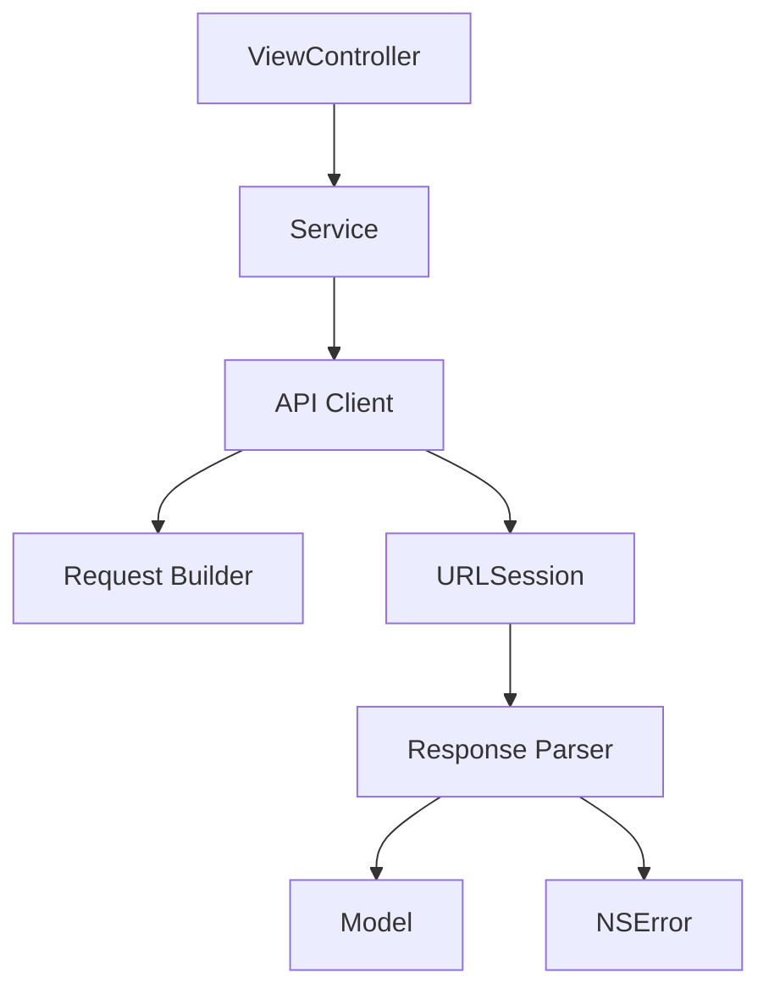
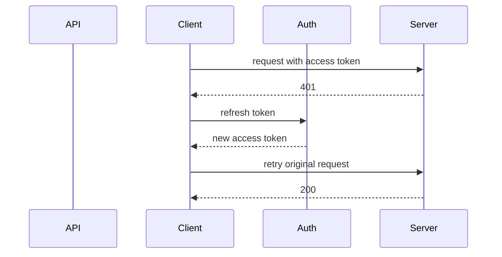

网络层负责让 App 和服务端交换数据。iOS 网络学习的重点不是只会发请求，而是理解请求结构、异步回调、错误边界、数据解析和工程封装。

## 1. HTTP 基础

一次 HTTP 请求通常包含：

- URL：请求地址。
- Method：请求方法，比如 GET、POST。
- Headers：请求头，比如 token、内容类型。
- Body：请求体，POST 常用。
- Status Code：响应状态码。
- Response Body：响应数据。

```text
GET /articles?page=1 HTTP/1.1
Host: example.com
Authorization: Bearer token
```

状态码常见含义：

- 2xx：成功。
- 3xx：重定向。
- 4xx：客户端错误。
- 5xx：服务端错误。

## 2. GET 和 POST

GET 通常用于读取数据，参数经常放在 URL 中。

```text
https://api.example.com/articles?page=1
```

POST 通常用于提交数据，请求体携带 JSON。

```json
{
  "name": "Yaw",
  "age": 20
}
```

实际业务中不能只靠方法名判断安全性，还要看服务端接口约定。

## 3. NSURLSession

`NSURLSession` 是系统网络请求核心类。

```objc
NSURL *url = [NSURL URLWithString:@"https://api.example.com/articles"];
NSURLSessionDataTask *task = [[NSURLSession sharedSession] dataTaskWithURL:url
                                                          completionHandler:^(NSData *data, NSURLResponse *response, NSError *error) {
    if (error) {
        NSLog(@"%@", error);
        return;
    }

    NSDictionary *json = [NSJSONSerialization JSONObjectWithData:data options:0 error:nil];
    NSLog(@"%@", json);
}];
[task resume];
```

请求创建后必须调用 `resume`。回调不保证在主线程，更新 UI 要切回主线程。

```objc
dispatch_async(dispatch_get_main_queue(), ^{
    self.titleLabel.text = @"loaded";
});
```

## 4. 请求封装

真实项目不应在每个页面里散写 `NSURLSession`。更常见的是封装 NetworkClient。

```objc
typedef void(^NetworkCompletion)(id _Nullable object, NSError * _Nullable error);

@interface NetworkClient : NSObject
- (void)GET:(NSString *)path completion:(NetworkCompletion)completion;
@end
```

封装层通常负责：

- 拼接 baseURL。
- 设置公共 headers。
- 处理 token。
- 解析 JSON。
- 统一错误模型。
- 切换回主线程。

页面只关心业务结果，不关心底层请求细节。

## 5. JSON 解析

服务端返回的数据通常是 JSON。

```objc
NSError *error = nil;
NSDictionary *dict = [NSJSONSerialization JSONObjectWithData:data options:0 error:&error];
```

解析时要注意：

- 字段可能缺失。
- 类型可能不符合预期。
- 服务端可能返回 `null`，对应 Objective-C 中的 `NSNull`。

```objc
id name = dict[@"name"];
if ([name isKindOfClass:NSString.class]) {
    model.name = name;
}
```

不要直接假设所有字段类型都正确。

## 6. Model 转换

Model 是网络数据进入业务层后的结构。

```objc
@interface Article : NSObject
@property (nonatomic, copy) NSString *title;
@property (nonatomic, copy) NSString *articleId;
@end
```

转换时最好集中处理。

```objc
+ (instancetype)modelWithDictionary:(NSDictionary *)dict {
    Article *article = [[Article alloc] init];
    article.title = [dict[@"title"] isKindOfClass:NSString.class] ? dict[@"title"] : @"";
    article.articleId = [dict[@"id"] isKindOfClass:NSString.class] ? dict[@"id"] : @"";
    return article;
}
```

不要让 UI 直接依赖原始 JSON。

## 7. 错误处理

网络错误至少分三类：

- 连接错误：断网、超时、DNS 失败。
- 协议错误：HTTP 状态码异常。
- 业务错误：服务端返回业务 code。

```objc
NSHTTPURLResponse *httpResponse = (NSHTTPURLResponse *)response;
if (httpResponse.statusCode < 200 || httpResponse.statusCode >= 300) {
    // Handle HTTP error.
}
```

统一错误模型可以避免页面各自处理错误文案和重试逻辑。

## 8. 取消请求

页面消失后，某些请求应该取消。

```objc
@property (nonatomic, strong) NSURLSessionDataTask *task;

- (void)viewWillDisappear:(BOOL)animated {
    [super viewWillDisappear:animated];
    [self.task cancel];
}
```

不是所有请求都要取消。提交订单、上传日志、支付状态同步等任务可能需要继续执行。是否取消取决于业务语义。

## 9. 图片加载

图片加载不是简单请求。它涉及缓存、解码、占位图、取消和复用。

列表中加载图片要注意 cell 复用：

```objc
cell.imageView.image = placeholder;
NSString *url = model.imageURL;
[imageLoader load:url completion:^(UIImage *image) {
    cell.imageView.image = image;
}];
```

真实项目中还要校验当前 cell 是否仍然对应同一个 model，避免图片错位。

## 10. 网络层不应该散落在页面里

一个成熟 iOS 项目的网络层至少要解决：

- 请求如何创建。
- 参数如何编码。
- Header 如何统一添加。
- Token 过期如何处理。
- 响应如何解析。
- 错误如何归类。
- 请求如何取消。
- 日志如何记录。
- 缓存如何接入。

如果每个 ViewController 都自己写 `NSURLSession`，项目很快会出现重复代码和行为不一致。



页面只应该知道“我要加载数据”，不应该知道每个接口怎么拼 URL、怎么处理状态码。

## 11. 请求对象化

把请求参数对象化，可以避免 URL、参数、方法散落。

```objc
typedef NS_ENUM(NSInteger, YWHTTPMethod) {
    YWHTTPMethodGET,
    YWHTTPMethodPOST
};

NS_ASSUME_NONNULL_BEGIN

@interface YWAPIRequest : NSObject

@property (nonatomic, copy) NSString *path;
@property (nonatomic, assign) YWHTTPMethod method;
@property (nonatomic, copy) NSDictionary<NSString *, id> *parameters;
@property (nonatomic, copy) NSDictionary<NSString *, NSString *> *headers;

@end

NS_ASSUME_NONNULL_END
```

构建 `NSURLRequest`：

```objc
- (NSMutableURLRequest *)urlRequestWithBaseURL:(NSURL *)baseURL request:(YWAPIRequest *)request {
    NSURL *url = [baseURL URLByAppendingPathComponent:request.path];
    NSMutableURLRequest *urlRequest = [NSMutableURLRequest requestWithURL:url];

    urlRequest.HTTPMethod = request.method == YWHTTPMethodGET ? @"GET" : @"POST";

    [request.headers enumerateKeysAndObjectsUsingBlock:^(NSString *key, NSString *value, BOOL *stop) {
        [urlRequest setValue:value forHTTPHeaderField:key];
    }];

    if (request.method == YWHTTPMethodPOST) {
        urlRequest.HTTPBody = [NSJSONSerialization dataWithJSONObject:request.parameters ?: @{}
                                                              options:0
                                                                error:nil];
        [urlRequest setValue:@"application/json" forHTTPHeaderField:@"Content-Type"];
    }

    return urlRequest;
}
```

这只是基础版，真实项目还要处理 GET query、超时、签名、公共参数等。

## 12. 状态码不是业务成功

HTTP 状态码只表示协议层结果，不一定表示业务成功。

常见结构：

```json
{
  "code": 0,
  "message": "success",
  "data": {}
}
```

需要分两层判断：

- HTTP 层：是否 2xx、是否网络错误。
- 业务层：`code` 是否成功。

```objc
- (void)handleResponse:(NSHTTPURLResponse *)response
                  data:(NSData *)data
            completion:(void (^)(id _Nullable object, NSError * _Nullable error))completion {
    if (response.statusCode < 200 || response.statusCode >= 300) {
        NSError *error = [NSError errorWithDomain:@"YWNetworkErrorDomain"
                                             code:response.statusCode
                                         userInfo:@{NSLocalizedDescriptionKey: @"HTTP request failed"}];
        completion(nil, error);
        return;
    }

    NSDictionary *json = [NSJSONSerialization JSONObjectWithData:data options:0 error:nil];
    NSInteger code = [json[@"code"] integerValue];
    if (code != 0) {
        NSError *error = [NSError errorWithDomain:@"YWBusinessErrorDomain"
                                             code:code
                                         userInfo:@{NSLocalizedDescriptionKey: json[@"message"] ?: @"Business error"}];
        completion(nil, error);
        return;
    }

    completion(json[@"data"], nil);
}
```

这能让调用方区分是网络坏了，还是业务失败。

## 13. 错误分类要可恢复

错误处理不应该只弹一个“请求失败”。至少要能区分：

- 无网络。
- 超时。
- 服务器错误。
- 业务错误。
- 登录过期。
- 解析失败。
- 请求取消。

```objc
typedef NS_ENUM(NSInteger, YWNetworkErrorCode) {
    YWNetworkErrorCodeUnknown = -1,
    YWNetworkErrorCodeNoConnection = -1009,
    YWNetworkErrorCodeTimedOut = -1001,
    YWNetworkErrorCodeCancelled = -999,
    YWNetworkErrorCodeInvalidResponse = 10001,
    YWNetworkErrorCodeBusinessFailed = 10002
};
```

错误分类的目的不是漂亮，而是决定恢复策略：

- 无网络：展示离线状态。
- 超时：允许重试。
- 登录过期：刷新 Token 或跳登录。
- 解析失败：记录日志，提示版本异常。
- 取消：通常不提示用户。

## 14. Token 刷新与请求重放

登录态过期是网络层常见复杂点。

基本策略：

1. 请求返回 401。
2. 网络层暂停后续需要登录的请求。
3. 使用 refresh token 刷新 access token。
4. 刷新成功后重放原请求。
5. 刷新失败后退出登录。



这个逻辑不应该写在每个页面里，否则会产生多个页面同时刷新 Token、重复弹登录、请求顺序混乱的问题。

## 15. 请求取消

页面退出后，不一定还需要继续处理请求结果。至少要避免已释放页面被回调强持有。

```objc
@property (nonatomic, strong, nullable) NSURLSessionDataTask *task;

- (void)viewDidLoad {
    [super viewDidLoad];

    __weak typeof(self) weakSelf = self;
    self.task = [self.client GET:@"/articles" completion:^(id _Nullable object, NSError * _Nullable error) {
        __strong typeof(weakSelf) self = weakSelf;
        if (!self) {
            return;
        }

        [self reloadWithObject:object];
    }];
}

- (void)dealloc {
    [self.task cancel];
}
```

请求取消后如果收到 `NSURLErrorCancelled`，通常不需要弹错误。

## 16. 图片加载不是简单下载

图片加载涉及：

- 内存缓存。
- 磁盘缓存。
- 下载队列。
- Cell 复用防错。
- 图片解码。
- 占位图。
- 失败重试。

Cell 复用场景必须校验 URL：

```objc
- (void)configureWithURL:(NSURL *)url {
    self.currentURL = url;
    self.thumbnailImageView.image = self.placeholderImage;

    __weak typeof(self) weakSelf = self;
    [self.imageLoader loadImageWithURL:url completion:^(UIImage * _Nullable image) {
        __strong typeof(weakSelf) self = weakSelf;
        if (!self) {
            return;
        }

        if (![self.currentURL isEqual:url]) {
            return;
        }

        self.thumbnailImageView.image = image;
    }];
}
```

否则旧请求回来后可能把图片设置到新复用的 Cell 上。

## 17. Swift 混编提示

Objective-C 网络层给 Swift 用时，要把错误和空值表达清楚：

```objc
NS_ASSUME_NONNULL_BEGIN

typedef void(^YWAPICompletion)(id _Nullable object, NSError * _Nullable error);

@interface YWAPIClient : NSObject

- (NSURLSessionDataTask *)GET:(NSString *)path
                   parameters:(nullable NSDictionary<NSString *, id> *)parameters
                   completion:(YWAPICompletion)completion;

@end

NS_ASSUME_NONNULL_END
```

Swift 侧可以自然处理 optional：

```swift
client.get("/articles", parameters: nil) { object, error in
    if let error {
        print(error)
        return
    }

    print(object as Any)
}
```

如果 Objective-C 没有 Nullability，Swift 会得到很多隐式可选，调用者容易误判。

## 18. 掌握标准

应当能做到：

- 说清楚 HTTP 请求和响应结构。
- 能用 `NSURLSession` 发起基本请求。
- 知道网络回调不一定在主线程。
- 能封装统一网络层。
- 能处理 JSON 类型安全和 `NSNull`。
- 能区分连接错误、HTTP 错误和业务错误。
- 能处理请求取消和图片加载复用问题。

网络层的核心是边界清楚：页面负责展示，网络层负责请求，Model 负责承载业务数据。
