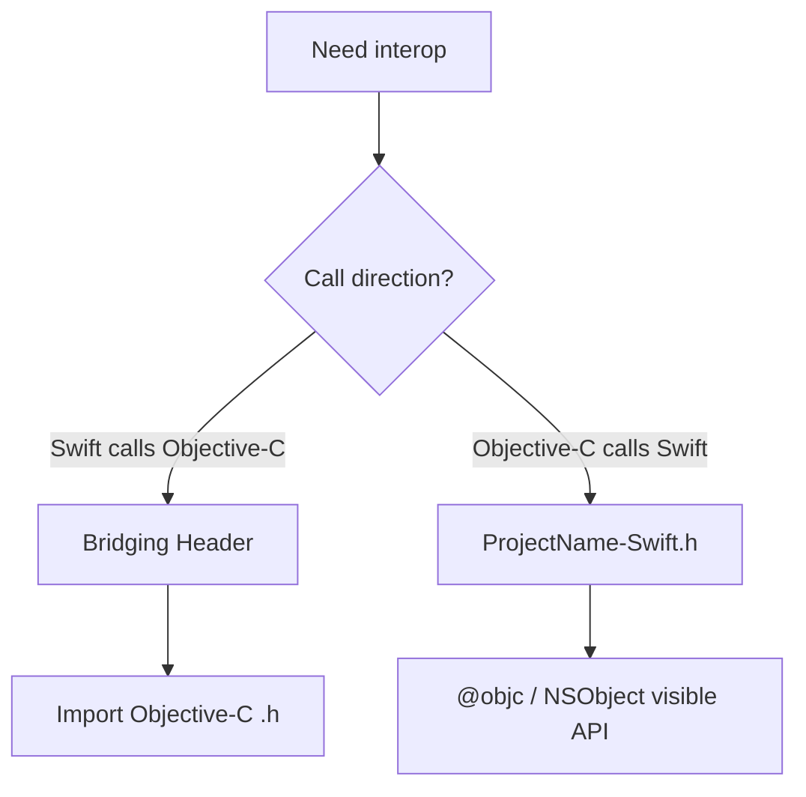

很多 iOS 项目不是纯 Objective-C，也不是纯 Swift，而是长期混编。掌握混编能力，能让老项目逐步引入 Swift，也能让 Swift 代码复用 Objective-C 基础库。

混编的重点不是语法互调，而是边界清晰、类型可见、空值明确、构建稳定。

## 1. Swift 调 Objective-C

Swift 调用 Objective-C，需要通过 Bridging Header 暴露 Objective-C 头文件。

例如工程里有一个 Objective-C 类：

```objc
// YWUserService.h
@interface YWUserService : NSObject

- (void)fetchNameWithCompletion:(void(^)(NSString *name))completion;

@end
```

在 `ProjectName-Bridging-Header.h` 中引入：

```objc
#import "YWUserService.h"
```

Swift 中就可以使用：

```swift
let service = YWUserService()
service.fetchName { name in
    print(name)
}
```

Bridging Header 适合暴露需要给 Swift 使用的 Objective-C 接口，不应该把所有头文件都塞进去。

## 2. Objective-C 调 Swift

Objective-C 调 Swift，需要引入 Xcode 自动生成的 Swift 头文件：

```objc
#import "ProjectName-Swift.h"
```

Swift 类需要继承 `NSObject`，并用 `@objc` 或 `@objcMembers` 暴露给 Objective-C。

```swift
@objcMembers
class YWFormatter: NSObject {
    func displayName(_ name: String) -> String {
        return name.isEmpty ? "未命名" : name
    }
}
```

Objective-C 调用：

```objc
YWFormatter *formatter = [[YWFormatter alloc] init];
NSString *name = [formatter displayName:@"Yaw"];
NSLog(@"%@", name);
```

不是所有 Swift 能力都能直接暴露给 Objective-C。比如 Swift 的泛型、结构体、枚举关联值等，需要转换成 Objective-C 能理解的形式。

## 3. Nullability

Objective-C 原本没有 Swift 那种明确的可选类型。为了让 Swift 更准确地理解 Objective-C API，需要使用 Nullability。

```objc
NS_ASSUME_NONNULL_BEGIN

@interface YWUser : NSObject

@property (nonatomic, copy) NSString *name;
@property (nonatomic, copy, nullable) NSString *nickname;

- (nullable NSString *)displayNameWithPrefix:(NSString *)prefix;

@end

NS_ASSUME_NONNULL_END
```

Swift 看到后会更清楚哪些值可能为空：

```swift
let name: String = user.name
let nickname: String? = user.nickname
```

没有 Nullability 的 Objective-C API，在 Swift 中会变成隐式可选，使用体验差，也更容易留下崩溃风险。

## 4. 泛型标注

Objective-C 集合可以用轻量泛型标注元素类型。

```objc
@property (nonatomic, copy) NSArray<NSString *> *titles;
@property (nonatomic, copy) NSDictionary<NSString *, NSNumber *> *scores;
```

Swift 侧可以得到更准确的类型：

```swift
let titles: [String] = object.titles
let scores: [String: NSNumber] = object.scores
```

这能减少强制转换，也能提升自动补全和编译检查质量。

## 5. Swift 名称暴露

Objective-C 方法名在 Swift 中会被导入成 Swift 风格。

Objective-C：

```objc
- (void)loadUserWithId:(NSString *)userId completion:(void(^)(YWUser *user))completion;
```

Swift：

```swift
service.loadUser(withId: "1001") { user in
    print(user)
}
```

如果默认导入名称不理想，可以用 `NS_SWIFT_NAME` 调整。

```objc
- (void)loadUserWithId:(NSString *)userId
            completion:(void(^)(YWUser *user))completion
NS_SWIFT_NAME(loadUser(id:completion:));
```

API 命名要照顾两边调用体验，尤其是基础库和公共组件。

## 6. Block 与闭包

Objective-C Block 会桥接成 Swift 闭包。

```objc
typedef void(^YWCompletion)(BOOL success, NSError * _Nullable error);

- (void)submitWithCompletion:(YWCompletion)completion;
```

Swift 调用：

```swift
service.submit { success, error in
    if success {
        print("success")
    } else {
        print(error?.localizedDescription ?? "")
    }
}
```

需要注意循环引用。Swift 中同样要使用 `[weak self]`。

```swift
service.submit { [weak self] success, error in
    guard let self else { return }
    self.reload()
}
```

## 7. 错误处理

Objective-C 常用 `NSError **` 或 completion 返回 `NSError`。

```objc
- (BOOL)saveUser:(YWUser *)user error:(NSError **)error;
```

Swift 可能会导入成 `throws` 风格，也可能仍然以 NSError 形式调用，取决于 API 形态。

设计混编 API 时，错误要明确表达，不要只返回 `nil` 或 `NO` 却没有错误信息。

## 8. 类型边界

Objective-C 和 Swift 的类型系统不同。混编时要特别注意：

- Swift `String` 与 `NSString`。
- Swift `Array` 与 `NSArray`。
- Swift `Dictionary` 与 `NSDictionary`。
- Swift `Bool` 与 `BOOL`。
- Swift Optional 与 Objective-C nullable。
- Swift struct 不能直接作为普通 Objective-C 类使用。

如果 Swift 类型需要给 Objective-C 使用，优先设计成 `NSObject` 子类或提供 Objective-C 友好的包装层。

```swift
@objcMembers
class YWUserDTO: NSObject {
    let userId: String
    let name: String

    init(userId: String, name: String) {
        self.userId = userId
        self.name = name
    }
}
```

## 9. 工程边界

混编项目要避免双向依赖混乱。

建议：

- Objective-C 基础能力可以通过 Bridging Header 给 Swift 使用。
- Swift 新模块尽量通过少量 Facade 暴露给 Objective-C。
- 公共类型保持简单，少暴露 Swift 复杂特性。
- Bridging Header 保持轻量，减少编译成本。
- 不要让 Swift 和 Objective-C 文件互相形成难以理解的调用链。

混编的目标是逐步演进，不是把两套语言揉成一团。

## 10. 常见问题

常见编译问题：

- 找不到 `ProjectName-Swift.h`。
- Swift 类没有继承 `NSObject`，Objective-C 不可见。
- Swift 方法没有 `@objc`，Objective-C 不可见。
- Objective-C 头文件没有加入 Bridging Header。
- 头文件循环引用导致编译失败。
- Swift 类型使用了 Objective-C 无法表达的特性。

排查时先确认方向：是 Swift 调 Objective-C，还是 Objective-C 调 Swift。方向不同，入口文件不同。

## 11. 混编的方向必须先分清

混编问题先判断方向：



方向不同，入口完全不同。很多“找不到类”的问题都是方向判断错了。

## 12. Objective-C API 如何对 Swift 友好

Swift 不是简单把 Objective-C 方法翻译过去。Objective-C API 写得好不好，会直接影响 Swift 调用体验。

### Nullability

```objc
NS_ASSUME_NONNULL_BEGIN

@interface YWUserService : NSObject

- (void)loadUserWithId:(NSString *)userId
            completion:(void (^)(YWUser * _Nullable user,
                                 NSError * _Nullable error))completion;

@end

NS_ASSUME_NONNULL_END
```

Swift 侧：

```swift
service.loadUser(withId: "1001") { user, error in
    guard let user else {
        print(error as Any)
        return
    }

    print(user.name)
}
```

如果不标注，Swift 会得到隐式可选，编译器无法充分保护调用方。

### Lightweight Generics

```objc
@property (nonatomic, copy) NSArray<YWArticle *> *articles;
```

Swift 侧会更接近 `[YWArticle]`，减少手动转换。

### 命名

Objective-C 方法名要能自然导入 Swift。

```objc
- (void)fetchArticlesWithPage:(NSInteger)page
                   completion:(void (^)(NSArray<YWArticle *> *articles))completion
NS_SWIFT_NAME(fetchArticles(page:completion:));
```

公共 API 要同时考虑两种语言的调用者。

## 13. Swift 暴露给 Objective-C 的限制

Objective-C 不能理解所有 Swift 特性。

通常不能直接暴露：

- 纯 Swift struct。
- 带关联值的 enum。
- Swift 泛型类型。
- Swift protocol with associated type。
- async 方法直接给 Objective-C 调用。

需要包装：

```swift
struct Article {
    let id: String
    let title: String
}

@objcMembers
final class YWArticleDTO: NSObject {
    let articleId: String
    let title: String

    init(article: Article) {
        self.articleId = article.id
        self.title = article.title
    }
}
```

Objective-C 调的是 DTO，不需要理解 Swift struct。

## 14. async/await 与 Objective-C 回调

Swift async 方法不能直接当成普通 Objective-C 方法调用。可以提供桥接 Facade。

```swift
@objcMembers
final class YWArticleSwiftFacade: NSObject {
    func loadArticles(completion: @escaping ([YWArticleDTO]?, NSError?) -> Void) {
        Task {
            do {
                let articles = try await ArticleService().loadArticles()
                let dtos = articles.map { YWArticleDTO(article: $0) }
                await MainActor.run {
                    completion(dtos, nil)
                }
            } catch {
                await MainActor.run {
                    completion(nil, error as NSError)
                }
            }
        }
    }
}
```

这里明确把 Swift async 转成 Objective-C 能理解的 completion，并保证回调回到主线程。

## 15. Block 和 Closure 的生命周期

Objective-C Block 与 Swift closure 桥接时，循环引用仍然存在。

Objective-C：

```objc
@property (nonatomic, copy, nullable) void (^completion)(void);
```

Swift：

```swift
object.completion = { [weak self] in
    guard let self else { return }
    self.reload()
}
```

Swift 写法变了，但内存语义没变：对象持有 closure，closure 捕获对象，就会形成环。

## 16. NSError 与 Swift Error

Objective-C 常用 `NSError`，Swift 常用 `Error` 和 `throws`。

给混编边界设计 API 时，不要只返回 `BOOL`：

```objc
- (BOOL)saveArticle:(YWArticle *)article error:(NSError **)error;
```

Swift 可以更自然地处理：

```swift
do {
    try store.saveArticle(article)
} catch {
    print(error)
}
```

如果 Objective-C 只返回 `NO`，Swift 调用方拿不到失败原因，排查困难。

## 17. 头文件依赖和编译成本

Bridging Header 会影响 Swift 编译。放进去的 Objective-C 头越多，Swift 编译越容易变慢，也更容易因为某个 Objective-C 头的问题导致 Swift 编译失败。

建议：

- 只暴露 Swift 必须使用的头。
- 公共头尽量少 import，优先 forward declaration。
- 大型 Objective-C 模块通过 Facade 暴露。
- 不要把内部私有头放进 Bridging Header。

Objective-C 头文件：

```objc
@class YWUser;

@interface YWUserCell : UITableViewCell

- (void)renderWithUser:(YWUser *)user;

@end
```

在 `.m` 中再 import 具体头文件。这能减少头文件依赖扩散。

## 18. 混编迁移策略

老 Objective-C 项目引入 Swift，不建议一次性大改。

更稳的路径：

1. 从独立工具类或新页面开始。
2. 用 Facade 控制 Swift 对 Objective-C 的暴露面。
3. Objective-C 基础 Model 补 Nullability。
4. 新模块内部可以 Swift 化，对外保持稳定。
5. 每次迁移都保证可回滚。

混编的目标是演进，不是制造两套互相看不懂的代码。

## 19. 掌握标准

掌握 Swift 混编，需要能做到：

- 能配置 Bridging Header，让 Swift 调 Objective-C。
- 能引入 `ProjectName-Swift.h`，让 Objective-C 调 Swift。
- 能用 `@objc`、`@objcMembers`、`NSObject` 暴露 Swift 类。
- 能为 Objective-C API 补充 Nullability 和泛型标注。
- 能理解 Block 与 Swift 闭包的对应关系。
- 能处理混编中的循环引用。
- 能设计 Objective-C 友好的 Swift 对外接口。
- 能控制混编边界，避免工程依赖混乱。
