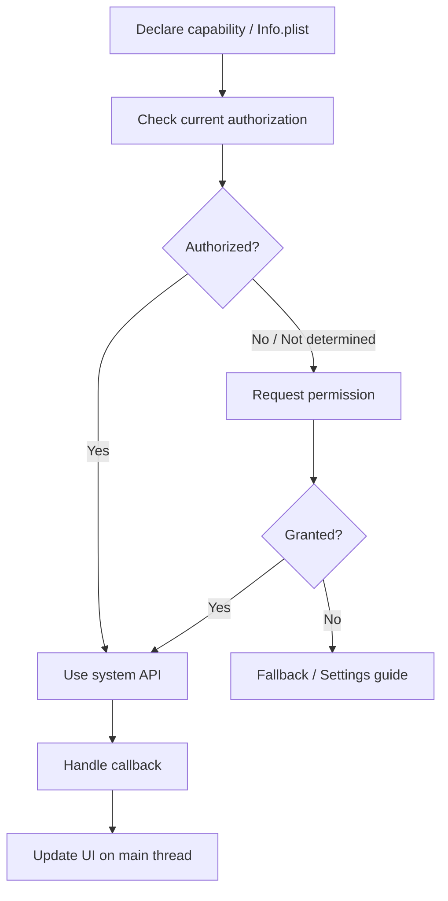
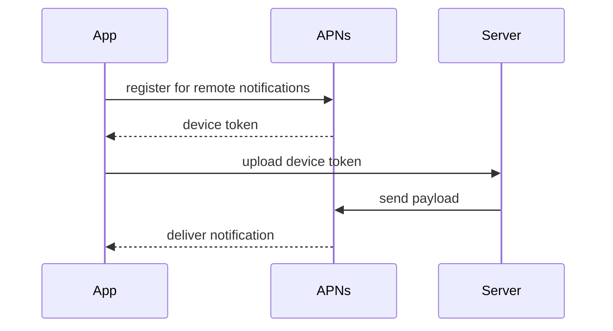

系统能力是 App 和 iOS 系统交互的部分。相机、相册、定位、推送、分享、WebView、后台任务都属于这个范围。

学习系统能力时要抓住三个问题：怎么申请权限，怎么调用 API，用户拒绝后怎么处理。

## 1. 权限管理

很多系统能力都需要权限。权限不是代码细节，而是产品体验的一部分。

常见权限：

- 相机：`NSCameraUsageDescription`
- 相册：`NSPhotoLibraryUsageDescription`
- 定位：`NSLocationWhenInUseUsageDescription`
- 麦克风：`NSMicrophoneUsageDescription`
- 通知：运行时请求授权

权限文案写在 `Info.plist`：

```xml
<key>NSCameraUsageDescription</key>
<string>需要使用相机拍摄头像</string>
```

权限处理要考虑：

- 首次请求。
- 用户同意。
- 用户拒绝。
- 用户在设置中关闭。
- 功能是否可以降级。

## 2. 相机

简单拍照可以使用 `UIImagePickerController`。

```objc
if ([UIImagePickerController isSourceTypeAvailable:UIImagePickerControllerSourceTypeCamera]) {
    UIImagePickerController *picker = [[UIImagePickerController alloc] init];
    picker.sourceType = UIImagePickerControllerSourceTypeCamera;
    picker.delegate = self;
    [self presentViewController:picker animated:YES completion:nil];
}
```

接收图片：

```objc
- (void)imagePickerController:(UIImagePickerController *)picker
didFinishPickingMediaWithInfo:(NSDictionary<UIImagePickerControllerInfoKey,id> *)info {
    UIImage *image = info[UIImagePickerControllerOriginalImage];
    self.avatarImageView.image = image;

    [picker dismissViewControllerAnimated:YES completion:nil];
}
```

更复杂的拍摄、扫码、视频录制通常会使用 `AVFoundation`。

## 3. 相册

访问相册前要处理权限。现代项目常使用 Photos 框架。

```objc
[PHPhotoLibrary requestAuthorization:^(PHAuthorizationStatus status) {
    dispatch_async(dispatch_get_main_queue(), ^{
        if (status == PHAuthorizationStatusAuthorized) {
            NSLog(@"photo authorized");
        } else {
            NSLog(@"photo denied");
        }
    });
}];
```

相册权限从 iOS 14 开始有“有限访问”模式，用户可以只授权部分照片。实际项目需要适配这种状态。

## 4. 定位

定位使用 `CLLocationManager`。

```objc
@interface YWLocationManager () <CLLocationManagerDelegate>

@property (nonatomic, strong) CLLocationManager *manager;

@end

@implementation YWLocationManager

- (void)start {
    self.manager = [[CLLocationManager alloc] init];
    self.manager.delegate = self;
    [self.manager requestWhenInUseAuthorization];
    [self.manager startUpdatingLocation];
}

- (void)locationManager:(CLLocationManager *)manager didUpdateLocations:(NSArray<CLLocation *> *)locations {
    CLLocation *location = locations.lastObject;
    NSLog(@"lat: %f, lng: %f", location.coordinate.latitude, location.coordinate.longitude);
}

@end
```

定位要注意耗电、精度、前后台权限和用户隐私。

## 5. 推送

推送分为两层：

- 用户授权通知展示。
- APNs 设备 Token 注册。

请求通知权限：

```objc
UNUserNotificationCenter *center = [UNUserNotificationCenter currentNotificationCenter];
[center requestAuthorizationWithOptions:(UNAuthorizationOptionAlert | UNAuthorizationOptionSound | UNAuthorizationOptionBadge)
                      completionHandler:^(BOOL granted, NSError *error) {
    NSLog(@"notification granted: %d", granted);
}];
```

推送链路通常涉及 App、APNs、业务服务器三方。客户端负责拿到 device token 并上传给服务器。

## 6. WebView

现代 iOS 使用 `WKWebView`。

```objc
WKWebView *webView = [[WKWebView alloc] initWithFrame:self.view.bounds];
[self.view addSubview:webView];

NSURL *url = [NSURL URLWithString:@"https://example.com"];
NSURLRequest *request = [NSURLRequest requestWithURL:url];
[webView loadRequest:request];
```

需要掌握：

- 加载 URL。
- 监听加载进度。
- 处理跳转拦截。
- JS 与 Native 通信。
- Cookie 和登录态。
- 白屏和内存问题。

## 7. 分享

系统分享可以使用 `UIActivityViewController`。

```objc
NSArray *items = @[@"分享内容", [NSURL URLWithString:@"https://yawzhang.github.io/blob/"]];
UIActivityViewController *controller = [[UIActivityViewController alloc] initWithActivityItems:items applicationActivities:nil];
[self presentViewController:controller animated:YES completion:nil];
```

系统分享的优点是简单稳定，缺点是定制能力有限。

## 8. Deep Link

Deep Link 用于从外部打开 App 的某个页面。

常见方式：

- URL Scheme。
- Universal Links。

URL Scheme 示例：

```text
yawzhang://post?id=123
```

App 收到链接后解析路径和参数，再跳转到对应页面。

```objc
- (BOOL)application:(UIApplication *)app openURL:(NSURL *)url options:(NSDictionary *)options {
    if ([url.host isEqualToString:@"post"]) {
        NSURLComponents *components = [NSURLComponents componentsWithURL:url resolvingAgainstBaseURL:NO];
        NSLog(@"open post: %@", components.query);
    }
    return YES;
}
```

Universal Links 使用 HTTPS 链接，体验更自然，但配置链路更复杂，需要服务器放置 `apple-app-site-association` 文件。

## 9. 后台任务

iOS 对后台运行限制严格。常见后台能力包括：

- 后台音频。
- 定位更新。
- 后台下载。
- 静默推送。
- BackgroundTasks。

不要假设 App 进入后台后还能一直运行。系统会根据电量、内存、用户行为管理后台时间。

## 10. 权限拒绝后的体验

权限被拒绝后，不应该反复弹窗。更合理的是解释功能受限，并提供去设置页的入口。

```objc
NSURL *url = [NSURL URLWithString:UIApplicationOpenSettingsURLString];
if ([[UIApplication sharedApplication] canOpenURL:url]) {
    [[UIApplication sharedApplication] openURL:url options:@{} completionHandler:nil];
}
```

权限体验要克制。用户还没理解功能价值时就请求权限，拒绝率通常更高。

## 11. 系统能力的通用接入模型

多数系统能力都可以按同一套模型理解：



相机、相册、定位、通知、麦克风都绕不开这条链路。区别只是权限枚举和 API 不同。

## 12. 权限请求时机

权限不应该在 App 启动时一口气请求。用户还不知道为什么需要权限，拒绝率会很高。

更合理的时机：

- 用户点击“拍摄头像”时请求相机。
- 用户点击“选择照片”时请求相册。
- 用户进入附近服务时请求定位。
- 用户开启提醒功能时请求通知。

权限文案要解释用途，不要写“需要权限才能使用”这种无效描述。

## 13. 相册有限权限

iOS 14 后，相册可能处于有限访问状态。用户只授权部分照片。

```objc
PHAuthorizationStatus status = [PHPhotoLibrary authorizationStatusForAccessLevel:PHAccessLevelReadWrite];

if (status == PHAuthorizationStatusLimited) {
    NSLog(@"limited photo access");
}
```

有限权限下，App 不能假设能读取整个相册。需要提供“管理可访问照片”的入口：

```objc
[[PHPhotoLibrary sharedPhotoLibrary] presentLimitedLibraryPickerFromViewController:self];
```

这类变化说明系统能力不是一次学完就不变，iOS 版本演进会改变权限模型。

## 14. 定位精度和耗电

定位不是越精确越好。精度越高、更新越频繁，耗电越明显。

```objc
self.manager.desiredAccuracy = kCLLocationAccuracyHundredMeters;
self.manager.distanceFilter = 100.0;
```

如果只是城市级服务，不应该使用最高精度连续定位。

定位还要处理授权变化：

```objc
- (void)locationManagerDidChangeAuthorization:(CLLocationManager *)manager {
    CLAuthorizationStatus status = manager.authorizationStatus;
    if (status == kCLAuthorizationStatusAuthorizedWhenInUse ||
        status == kCLAuthorizationStatusAuthorizedAlways) {
        [manager startUpdatingLocation];
    } else {
        [manager stopUpdatingLocation];
    }
}
```

权限变化可能发生在系统设置中，不能只处理首次授权。

## 15. 推送链路

推送不是客户端单独完成的功能。



客户端要处理：

- 请求通知权限。
- 注册远程推送。
- 上传 device token。
- 处理前台通知展示。
- 处理用户点击通知后的路由。
- 退出登录后解绑 token 或更新账号关系。

device token 可能变化，不要假设永久不变。

## 16. WebView 的安全边界

`WKWebView` 常用于 H5 页面，但它会带来安全和稳定性问题。

需要关注：

- 只加载可信域名。
- JS 调 Native 的方法白名单。
- 参数校验。
- Cookie 同步。
- 页面白屏监控。
- 内存占用。

JS Bridge 示例：

```objc
[configuration.userContentController addScriptMessageHandler:self name:@"native"];

- (void)userContentController:(WKUserContentController *)userContentController
      didReceiveScriptMessage:(WKScriptMessage *)message {
    if (![message.name isEqualToString:@"native"]) {
        return;
    }

    if (![message.body isKindOfClass:NSDictionary.class]) {
        return;
    }

    NSDictionary *body = (NSDictionary *)message.body;
    NSString *action = body[@"action"];
    if ([action isEqualToString:@"openArticle"]) {
        [self openArticleWithPayload:body];
    }
}
```

不要让 H5 任意调用 Native 方法。Bridge 本质上是跨边界接口，必须校验。

## 17. Deep Link 的路由安全

Deep Link 能从外部打开 App 页面，也意味着外部输入可以进入你的路由系统。

必须校验：

- scheme / host 是否可信。
- path 是否存在。
- 参数是否合法。
- 是否需要登录。
- 是否有权限访问。

```objc
- (BOOL)handleURL:(NSURL *)url {
    if (![url.scheme isEqualToString:@"yawzhang"]) {
        return NO;
    }

    if ([url.host isEqualToString:@"post"]) {
        NSURLComponents *components = [NSURLComponents componentsWithURL:url resolvingAgainstBaseURL:NO];
        NSString *postId = [self valueForName:@"id" inItems:components.queryItems];
        if (postId.length == 0) {
            return NO;
        }

        [self.router openPostWithId:postId];
        return YES;
    }

    return NO;
}
```

不要把 URL 参数直接拼进 SQL、文件路径或 WebView URL。

## 18. 后台能力的限制

iOS 后台能力是受限制的，不是申请了权限就能一直运行。

后台任务要考虑：

- 系统是否允许当前类型后台运行。
- 任务是否能在有限时间内完成。
- 失败后是否能恢复。
- 是否影响电量。
- 是否符合 App Store 审核规则。

普通 App 进入后台后，应保存状态、停止不必要任务，而不是试图长期保活。

## 19. Swift 混编提示

系统框架很多是 Swift 和 Objective-C 都可用，但混编时要注意：

- Delegate 对象生命周期，避免被释放。
- 权限回调线程，不要直接后台更新 UI。
- Objective-C API 暴露给 Swift 时标注 nullable。
- Swift enum/struct 如果要给 Objective-C 调用，需要包装。

例如把系统能力封装成 Objective-C 友好的服务：

```objc
NS_ASSUME_NONNULL_BEGIN

@interface YWPermissionService : NSObject

- (void)requestCameraPermissionWithCompletion:(void (^)(BOOL granted))completion;
- (void)openSystemSettings;

@end

NS_ASSUME_NONNULL_END
```

Swift 和 Objective-C 页面都调用同一层服务，权限策略就不会散落。

## 20. 掌握标准

掌握系统能力，需要能做到：

- 能为系统权限配置正确的 `Info.plist` 文案。
- 能处理授权、拒绝、受限等状态。
- 能使用相机和相册完成基础图片选择。
- 能使用定位获取位置并理解耗电和隐私问题。
- 能理解推送的客户端、APNs、服务端链路。
- 能使用 `WKWebView` 加载网页并理解 JS 通信方向。
- 能使用系统分享。
- 能理解 URL Scheme 和 Universal Links 的区别。
- 能设计权限拒绝后的降级体验。
