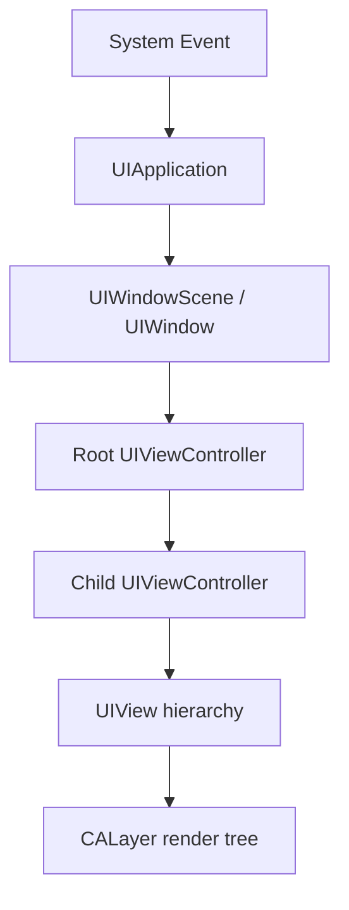
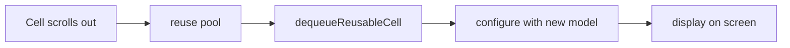

UIKit 是 Objective-C iOS 开发中最核心的 UI 框架。它负责窗口、页面、视图、控件、事件、导航和列表展示。掌握 UIKit，不是背控件名字，而是理解页面如何被组织、展示和响应用户操作。

## 1. UIKit 的基本结构

UIKit 页面通常由三层组成：

- `UIWindow`：应用显示内容的窗口。
- `UIViewController`：页面控制器，管理一屏内容的生命周期和交互。
- `UIView`：真正显示在屏幕上的视图。

```objc
UIViewController *vc = [[UIViewController alloc] init];
UIWindow *window = [[UIWindow alloc] initWithFrame:UIScreen.mainScreen.bounds];
window.rootViewController = vc;
[window makeKeyAndVisible];
```

现代项目里窗口创建通常放在 `SceneDelegate` 中。业务开发更多关注 `UIViewController` 和 `UIView`。

## 2. UIView：页面的显示单元

`UIView` 是 UIKit 中所有可视元素的基类。按钮、标签、图片、输入框、列表，本质上都继承自 `UIView`。

```objc
UIView *box = [[UIView alloc] initWithFrame:CGRectMake(20, 100, 120, 80)];
box.backgroundColor = UIColor.systemGreenColor;
[self.view addSubview:box];
```

需要理解三个点：

- view 有层级关系，通过 `addSubview:` 组成树。
- view 的位置和尺寸由 frame 或 Auto Layout 决定。
- view 本身只负责显示和事件承接，不应该承载大量业务逻辑。

## 3. UIViewController：页面的组织者

`UIViewController` 管理页面生命周期、数据加载、事件协调和页面跳转。它不应该变成所有逻辑的集中地。

```objc
@interface ProfileViewController : UIViewController
@end

@implementation ProfileViewController

- (void)viewDidLoad {
    [super viewDidLoad];
    self.view.backgroundColor = UIColor.whiteColor;
}

@end
```

控制器适合做协调工作：创建 UI、绑定事件、调用 ViewModel 或 Service、响应生命周期。网络请求、缓存、复杂计算和路由细节应逐渐拆出去。

## 4. 常见基础控件

基础控件用于构建普通页面。

```objc
UILabel *titleLabel = [[UILabel alloc] init];
titleLabel.text = @"UIKit";
titleLabel.font = [UIFont boldSystemFontOfSize:24];

UIButton *button = [UIButton buttonWithType:UIButtonTypeSystem];
[button setTitle:@"继续" forState:UIControlStateNormal];
[button addTarget:self action:@selector(handleTap) forControlEvents:UIControlEventTouchUpInside];

[self.view addSubview:titleLabel];
[self.view addSubview:button];
```

常见控件包括：

- `UILabel`：文本展示。
- `UIButton`：点击操作。
- `UIImageView`：图片展示。
- `UITextField` / `UITextView`：文本输入。
- `UIScrollView`：滚动容器。

## 5. UIScrollView：滚动能力的基础

`UIScrollView` 是很多复杂控件的基础，`UITableView` 和 `UICollectionView` 都继承自它。

```objc
UIScrollView *scrollView = [[UIScrollView alloc] initWithFrame:self.view.bounds];
scrollView.contentSize = CGSizeMake(self.view.bounds.size.width, 1200);
[self.view addSubview:scrollView];
```

理解 `UIScrollView` 重点看两个尺寸：

- `bounds`：屏幕上可见区域。
- `contentSize`：内部内容总尺寸。

能滚动，是因为内容尺寸大于可见区域。

## 6. UITableView：纵向列表

`UITableView` 适合纵向列表，比如设置页、消息列表、订单列表。

```objc
@interface ListViewController () <UITableViewDataSource>
@property (nonatomic, strong) UITableView *tableView;
@property (nonatomic, copy) NSArray<NSString *> *items;
@end

- (NSInteger)tableView:(UITableView *)tableView numberOfRowsInSection:(NSInteger)section {
    return self.items.count;
}

- (UITableViewCell *)tableView:(UITableView *)tableView cellForRowAtIndexPath:(NSIndexPath *)indexPath {
    UITableViewCell *cell = [tableView dequeueReusableCellWithIdentifier:@"cell"];
    if (!cell) {
        cell = [[UITableViewCell alloc] initWithStyle:UITableViewCellStyleDefault reuseIdentifier:@"cell"];
    }
    cell.textLabel.text = self.items[indexPath.row];
    return cell;
}
```

列表开发核心是复用。不要每次滚动都创建全新 cell，也不要在 `cellForRowAtIndexPath:` 中做重计算或同步网络请求。

## 7. UICollectionView：网格和复杂布局

`UICollectionView` 适合网格、瀑布流、横滑卡片、复杂布局。

```objc
UICollectionViewFlowLayout *layout = [[UICollectionViewFlowLayout alloc] init];
layout.itemSize = CGSizeMake(100, 100);
layout.minimumLineSpacing = 12;
layout.minimumInteritemSpacing = 12;

UICollectionView *collectionView = [[UICollectionView alloc] initWithFrame:self.view.bounds collectionViewLayout:layout];
```

它比 `UITableView` 更灵活，但也更依赖布局设计。复杂页面应优先拆分 cell、section 和数据模型。

## 8. 导航控制器

`UINavigationController` 管理栈式页面跳转。

```objc
DetailViewController *detail = [[DetailViewController alloc] init];
[self.navigationController pushViewController:detail animated:YES];
```

常见操作：

- push：进入下一级页面。
- pop：返回上一级页面。
- present：模态展示一个页面。
- dismiss：关闭模态页面。

导航逻辑不宜分散在各处。项目变大后，可以引入 Router 层统一处理跳转。

## 9. TabBar 控制器

`UITabBarController` 用来组织多个一级模块。

```objc
HomeViewController *home = [[HomeViewController alloc] init];
ProfileViewController *profile = [[ProfileViewController alloc] init];

UITabBarController *tab = [[UITabBarController alloc] init];
tab.viewControllers = @[home, profile];
```

Tab 页面通常常驻内存，切换 Tab 不等于释放页面。涉及刷新、埋点和资源释放时，需要结合生命周期理解。

## 10. UIKit 不是控件清单，而是一套事件驱动的 UI 框架

很多初学者学 UIKit 时会陷入一个误区：把 `UILabel`、`UIButton`、`UITableView` 当成孤立 API 记忆。真正进入项目后，难点通常不是“按钮怎么创建”，而是页面如何组织、状态如何流动、事件如何传递、视图何时布局、列表如何复用、控制器什么时候释放。

UIKit 的核心可以拆成四层：

- `UIApplication`：App 进程里的应用对象，接收系统事件。
- `UIWindow` / `UIWindowScene`：承载界面的窗口。
- `UIViewController`：页面和业务状态的组织者。
- `UIView`：负责显示、布局和响应触摸。



这条链路解释了很多问题：

- 页面为什么必须有根控制器。
- 为什么 ViewController 不负责真正绘制像素。
- 为什么 `UIView` 背后总有一个 `CALayer`。
- 为什么窗口、控制器、视图层级混乱时会出现页面不显示或事件点不到。

## 11. UIView 和 CALayer 的关系

`UIView` 主要负责事件、布局和管理视图层级；`CALayer` 负责显示内容、圆角、阴影、边框、动画等渲染相关能力。

```objc
self.avatarImageView.layer.cornerRadius = 24.0;
self.avatarImageView.layer.masksToBounds = YES;
self.avatarImageView.layer.borderWidth = 1.0;
self.avatarImageView.layer.borderColor = [UIColor systemGrayColor].CGColor;
```

这里设置的是 Layer，不是 View。原因是圆角、边框和阴影属于渲染属性。

需要注意 `masksToBounds` 和阴影经常冲突：

```objc
// 圆角裁剪
self.cardView.layer.cornerRadius = 12.0;
self.cardView.layer.masksToBounds = YES;

// 阴影需要超出 bounds 显示，如果 masksToBounds 为 YES，阴影会被裁掉。
self.cardView.layer.shadowColor = UIColor.blackColor.CGColor;
self.cardView.layer.shadowOpacity = 0.15;
self.cardView.layer.shadowRadius = 8.0;
self.cardView.layer.shadowOffset = CGSizeMake(0, 4);
```

工程里常用两层 View 解决：

```objc
UIView *shadowView = [[UIView alloc] init];
shadowView.layer.shadowColor = UIColor.blackColor.CGColor;
shadowView.layer.shadowOpacity = 0.12;
shadowView.layer.shadowRadius = 8.0;
shadowView.layer.shadowOffset = CGSizeMake(0, 4);

UIView *contentView = [[UIView alloc] init];
contentView.layer.cornerRadius = 12.0;
contentView.layer.masksToBounds = YES;

[shadowView addSubview:contentView];
```

外层负责阴影，内层负责圆角裁剪。这个细节比单纯记住属性更重要，因为它来自渲染模型。

## 12. UIViewController 的职责边界

`UIViewController` 容易变成超大文件。合理职责应该集中在页面协调：

- 创建和持有根 View。
- 处理生命周期。
- 绑定 View 与数据。
- 接收用户事件并转交给业务层。
- 管理页面跳转。

不应该长期堆在 ViewController 里的内容：

- 接口请求细节。
- 大段 JSON 解析。
- 图片缓存实现。
- 复杂格式化逻辑。
- 数据库读写细节。
- 复杂动画状态机。

一个更可维护的页面结构：

```objc
NS_ASSUME_NONNULL_BEGIN

@interface YWArticleListViewController : UIViewController
@end

@interface YWArticleListView : UIView

- (void)renderWithArticles:(NSArray<YWArticle *> *)articles;

@end

@interface YWArticleService : NSObject

- (void)fetchArticlesWithCompletion:(void (^)(NSArray<YWArticle *> * _Nullable articles,
                                              NSError * _Nullable error))completion;

@end

NS_ASSUME_NONNULL_END
```

控制器只做协调：

```objc
- (void)viewDidLoad {
    [super viewDidLoad];

    [self setupView];
    [self loadData];
}

- (void)loadData {
    __weak typeof(self) weakSelf = self;
    [self.articleService fetchArticlesWithCompletion:^(NSArray<YWArticle *> * _Nullable articles, NSError * _Nullable error) {
        __strong typeof(weakSelf) self = weakSelf;
        if (!self) {
            return;
        }

        if (error) {
            [self showError:error];
            return;
        }

        [self.articleListView renderWithArticles:articles ?: @[]];
    }];
}
```

这类拆分不是为了套模式，而是为了让页面代码可读、可测、可替换。

## 13. 列表复用的真正含义

`UITableView` 和 `UICollectionView` 的核心不是“显示很多 Cell”，而是复用少量 Cell 显示大量数据。

如果屏幕只能显示 10 个 Cell，列表有 1000 条数据，系统不会创建 1000 个 Cell。它会反复复用离开屏幕的 Cell。



复用带来的常见问题：旧状态残留。

错误示例：

```objc
- (void)configureWithArticle:(YWArticle *)article {
    self.titleLabel.text = article.title;

    if (article.isPinned) {
        self.badgeLabel.hidden = NO;
    }
}
```

如果上一次复用时 `badgeLabel.hidden = NO`，下一条非置顶文章没有把它改回 YES，就会显示错误状态。

正确做法是每次配置都覆盖完整状态：

```objc
- (void)configureWithArticle:(YWArticle *)article {
    self.titleLabel.text = article.title;
    self.summaryLabel.text = article.summary;
    self.badgeLabel.hidden = !article.isPinned;
    self.thumbnailImageView.image = nil;
}
```

`prepareForReuse` 用于清理异步和临时状态：

```objc
- (void)prepareForReuse {
    [super prepareForReuse];

    self.thumbnailImageView.image = nil;
    self.titleLabel.text = nil;
    self.summaryLabel.text = nil;
    self.badgeLabel.hidden = YES;
}
```

工程中要把 Cell 当成“可重复使用的渲染器”，不要把它当成“数据容器”。

## 14. UI 更新必须回到主线程

UIKit 不是线程安全的。网络回调、数据库读取、图片解码可能在后台线程完成，但 UI 更新必须切回主线程。

```objc
dispatch_async(dispatch_get_global_queue(DISPATCH_QUEUE_PRIORITY_DEFAULT, 0), ^{
    UIImage *decodedImage = [self decodeImage:data];

    dispatch_async(dispatch_get_main_queue(), ^{
        self.imageView.image = decodedImage;
    });
});
```

如果偶尔在后台线程更新 UI，可能不会立刻崩溃，但会产生随机错乱。随机性是线程问题最麻烦的地方。

## 15. UIKit 的防御性代码习惯

### 初始化入口要明确

自定义 View 推荐把公共初始化放到同一个方法：

```objc
@implementation YWProfileHeaderView

- (instancetype)initWithFrame:(CGRect)frame {
    self = [super initWithFrame:frame];
    if (self) {
        [self commonInit];
    }
    return self;
}

- (instancetype)initWithCoder:(NSCoder *)coder {
    self = [super initWithCoder:coder];
    if (self) {
        [self commonInit];
    }
    return self;
}

- (void)commonInit {
    self.backgroundColor = UIColor.systemBackgroundColor;
    [self addSubview:self.avatarImageView];
    [self addSubview:self.nameLabel];
}

@end
```

这样无论代码创建还是 Xib/Storyboard 创建，都能走同一套配置。

### 对外暴露不可变数据

```objc
@property (nonatomic, copy, readonly) NSArray<YWArticle *> *articles;
```

不要把内部可变数组直接暴露出去，否则外部可以绕过你的状态管理随意修改。

### Block 属性使用 copy

```objc
@property (nonatomic, copy, nullable) void (^didTapArticle)(YWArticle *article);
```

Block 从栈复制到堆后生命周期才稳定，`copy` 是 Objective-C 里 Block 属性的标准写法。

## 16. Swift 混编提示

Swift 调 UIKit 时类型更安全，但生命周期和线程规则没有改变。

- Swift 的 `UIViewController` 同样不能在后台线程更新 UI。
- Swift 闭包同样可能产生循环引用。
- Objective-C View 暴露给 Swift 时，应补充 Nullability，否则 Swift 侧会出现隐式可选。

Objective-C API：

```objc
NS_ASSUME_NONNULL_BEGIN

@interface YWProfileHeaderView : UIView

- (void)renderWithName:(NSString *)name avatarURL:(nullable NSURL *)avatarURL;

@end

NS_ASSUME_NONNULL_END
```

Swift 调用时就能得到清晰的可选边界。

## 17. UIKit 掌握标准

掌握 UIKit，应当能做到：

- 能解释 `UIWindow`、`UIViewController`、`UIView` 的职责。
- 能用基础控件搭建页面。
- 能理解 view 层级、事件响应和页面生命周期的关系。
- 能写出基本 `UITableView` / `UICollectionView` 页面。
- 能使用导航控制器和 TabBar 控制器组织页面。
- 能判断哪些逻辑应该留在控制器，哪些应该拆到 ViewModel、Service 或 Router。

UIKit 是页面开发的骨架。后续学习布局、事件、生命周期、网络和架构，都会围绕它展开。
