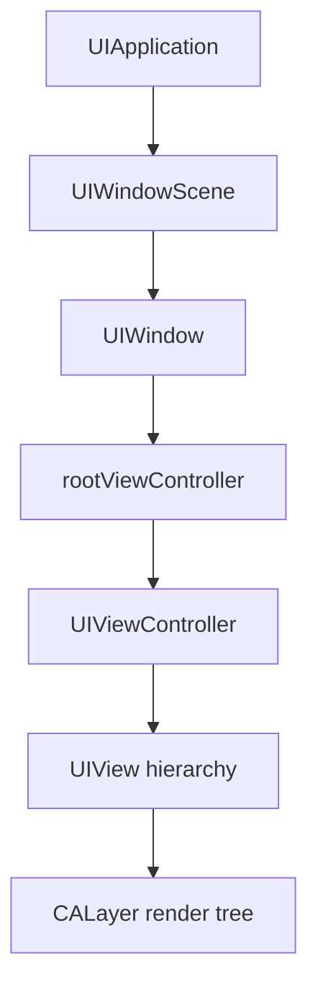
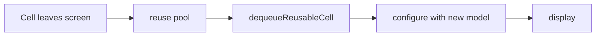
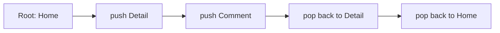
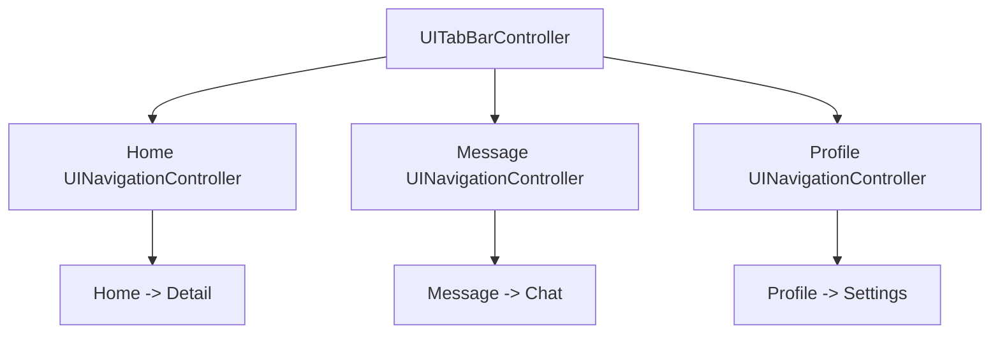

UIKit 是 Objective-C iOS 开发中最核心的 UI 框架。它负责窗口、页面、视图、控件、事件、导航、列表和页面容器。掌握 UIKit，不是记住控件名字，而是理解一个页面从窗口出现、控制器加载、视图布局、事件响应、页面跳转到释放的完整链路。

这一章按 UIKit 页面开发的主线展开：先理解 `UIWindow`、`UIViewController`、`UIView` 三个骨架，再逐个掌握 `UILabel`、`UIButton`、`UIImageView`、`UITextField`、`UIScrollView`、`UITableView`、`UICollectionView`、`UINavigationController`、`UITabBarController`。

## 1. UIKit 的页面结构

UIKit 页面不是从某个按钮开始的，而是从 App 的窗口和根控制器开始的。



这条链路对应几个核心职责：

- `UIApplication`：应用对象，接收系统事件。
- `UIWindowScene`：iOS 13 后的窗口场景。
- `UIWindow`：承载界面的窗口。
- `UIViewController`：管理页面生命周期和交互。
- `UIView`：显示内容、布局子视图、接收触摸。
- `CALayer`：最终负责渲染相关能力。

日常业务开发经常写的是 ViewController 和 View，但如果不理解 Window 和容器控制器，遇到启动页、根控制器切换、导航栈、Tab 切换、弹窗层级时就会很容易混乱。

## 2. UIWindow：界面的承载窗口

`UIWindow` 是 UIKit 显示内容的窗口。一个 App 至少需要一个 window，window 通过 `rootViewController` 承载页面。

iOS 13 之后，window 通常在 `SceneDelegate` 中创建：

```objc
- (void)scene:(UIScene *)scene
willConnectToSession:(UISceneSession *)session
      options:(UISceneConnectionOptions *)connectionOptions {
    if (![scene isKindOfClass:UIWindowScene.class]) {
        return;
    }

    UIWindowScene *windowScene = (UIWindowScene *)scene;
    UIWindow *window = [[UIWindow alloc] initWithWindowScene:windowScene];

    UIViewController *homeController = [[YWHomeViewController alloc] init];
    UINavigationController *navigationController = [[UINavigationController alloc] initWithRootViewController:homeController];

    window.rootViewController = navigationController;
    [window makeKeyAndVisible];

    self.window = window;
}
```

几个关键点：

- `rootViewController` 是整个界面树的入口。
- `makeKeyAndVisible` 会让 window 成为 key window 并显示。
- `SceneDelegate` 需要强持有 `window`，否则 window 可能释放。
- 根控制器可以是普通控制器、导航控制器、TabBar 控制器，也可以是自定义容器。

常见场景：登录态切换根控制器。

```objc
- (void)switchToMainInterface {
    YWHomeViewController *home = [[YWHomeViewController alloc] init];
    UINavigationController *nav = [[UINavigationController alloc] initWithRootViewController:home];
    self.window.rootViewController = nav;
}

- (void)switchToLoginInterface {
    YWLoginViewController *login = [[YWLoginViewController alloc] init];
    self.window.rootViewController = login;
}
```

根控制器切换适合登录/退出这类全局页面结构变化。普通页面跳转不要频繁替换 root，应该使用导航栈或模态展示。

## 3. UIViewController：页面的组织者

`UIViewController` 是一屏内容的组织者。它负责管理 view、生命周期、数据绑定、事件协调和页面跳转。

最基础的控制器：

```objc
@interface YWProfileViewController : UIViewController
@end

@implementation YWProfileViewController

- (void)viewDidLoad {
    [super viewDidLoad];

    self.view.backgroundColor = UIColor.systemBackgroundColor;
    [self setupViews];
    [self setupConstraints];
    [self loadData];
}

- (void)setupViews {
}

- (void)setupConstraints {
}

- (void)loadData {
}

@end
```

控制器的初始化方式要看页面是否需要参数。

无参数页面：

```objc
YWSettingsViewController *settings = [[YWSettingsViewController alloc] init];
```

有参数页面，推荐自定义初始化方法：

```objc
@interface YWArticleDetailViewController : UIViewController

- (instancetype)initWithArticleId:(NSString *)articleId NS_DESIGNATED_INITIALIZER;
- (instancetype)init NS_UNAVAILABLE;

@end

@implementation YWArticleDetailViewController {
    NSString *_articleId;
}

- (instancetype)initWithArticleId:(NSString *)articleId {
    self = [super initWithNibName:nil bundle:nil];
    if (self) {
        _articleId = [articleId copy];
    }
    return self;
}

@end
```

这样页面依赖在创建时就明确，不需要先创建再给属性赋值，避免漏传参数。

控制器职责要收敛：

- 适合：生命周期、创建 View、绑定事件、页面跳转、协调 ViewModel/Service。
- 不适合：大量 JSON 解析、数据库细节、复杂网络封装、图片缓存、跨业务状态管理。

如果一个 ViewController 越写越大，优先拆自定义 View、Service、ViewModel、Router。

## 4. UIView：页面的显示单元

`UIView` 是所有 UIKit 可视元素的基类。`UILabel`、`UIButton`、`UIImageView`、`UITextField`、`UITableViewCell` 都继承自它。

纯代码创建 View：

```objc
UIView *cardView = [[UIView alloc] initWithFrame:CGRectZero];
cardView.backgroundColor = UIColor.secondarySystemBackgroundColor;
cardView.layer.cornerRadius = 12.0;
[self.view addSubview:cardView];
```

View 的核心属性：

- `frame`：在父视图坐标系中的位置和尺寸。
- `bounds`：自身坐标系中的位置和尺寸。
- `center`：在父视图坐标系中的中心点。
- `backgroundColor`：背景色。
- `alpha`：透明度。
- `hidden`：是否隐藏。
- `userInteractionEnabled`：是否接收用户交互。

View 通过层级组成页面：

```objc
[self.view addSubview:cardView];
[cardView addSubview:titleLabel];
[cardView addSubview:button];
```

`UIView` 和 `CALayer` 的关系：

- `UIView` 负责事件、布局、视图层级。
- `CALayer` 负责显示、圆角、边框、阴影、动画等渲染属性。

圆角：

```objc
cardView.layer.cornerRadius = 12.0;
cardView.layer.masksToBounds = YES;
```

阴影：

```objc
cardView.layer.shadowColor = UIColor.blackColor.CGColor;
cardView.layer.shadowOpacity = 0.12;
cardView.layer.shadowRadius = 8.0;
cardView.layer.shadowOffset = CGSizeMake(0, 4);
```

圆角裁剪和阴影经常冲突。`masksToBounds = YES` 会裁剪超出 bounds 的内容，也会裁掉阴影。工程中常用两层 View：

```objc
UIView *shadowView = [[UIView alloc] init];
shadowView.layer.shadowColor = UIColor.blackColor.CGColor;
shadowView.layer.shadowOpacity = 0.12;
shadowView.layer.shadowRadius = 8.0;
shadowView.layer.shadowOffset = CGSizeMake(0, 4);

UIView *contentView = [[UIView alloc] init];
contentView.layer.cornerRadius = 12.0;
contentView.layer.masksToBounds = YES;

[shadowView addSubview:contentView];
```

外层负责阴影，内层负责圆角裁剪。

## 5. UILabel：文本展示

`UILabel` 用于展示不可编辑文本。它看起来简单，但项目中大部分界面信息都由 Label 承载。

初始化：

```objc
UILabel *titleLabel = [[UILabel alloc] init];
titleLabel.text = @"UIKit 基础";
titleLabel.textColor = UIColor.labelColor;
titleLabel.font = [UIFont boldSystemFontOfSize:24.0];
titleLabel.numberOfLines = 0;
titleLabel.textAlignment = NSTextAlignmentLeft;
[self.view addSubview:titleLabel];
```

常用属性：

- `text`：普通文本。
- `attributedText`：富文本。
- `font`：字体。
- `textColor`：文字颜色。
- `textAlignment`：对齐方式。
- `numberOfLines`：行数，`0` 表示不限行。
- `lineBreakMode`：截断方式。

富文本示例：

```objc
NSMutableAttributedString *text = [[NSMutableAttributedString alloc] initWithString:@"价格：¥99"];
[text addAttribute:NSForegroundColorAttributeName
             value:UIColor.secondaryLabelColor
             range:NSMakeRange(0, 3)];
[text addAttribute:NSForegroundColorAttributeName
             value:UIColor.systemRedColor
             range:NSMakeRange(3, text.length - 3)];
titleLabel.attributedText = text;
```

多行 Label 使用 Auto Layout 时要注意宽度。没有明确宽度，系统无法准确计算高度。

```objc
[NSLayoutConstraint activateConstraints:@[
    [titleLabel.leadingAnchor constraintEqualToAnchor:self.view.leadingAnchor constant:16.0],
    [titleLabel.trailingAnchor constraintEqualToAnchor:self.view.trailingAnchor constant:-16.0],
    [titleLabel.topAnchor constraintEqualToAnchor:self.view.safeAreaLayoutGuide.topAnchor constant:20.0]
]];
```

工程坑：

- 多行文本不设置 `numberOfLines = 0` 会只显示一行。
- 动态高度 Cell 中，Label 顶部到底部约束链不完整会导致高度计算错误。
- 富文本和普通文本不要混用后忘记清空旧状态，Cell 复用时容易残留样式。

## 6. UIButton：用户点击入口

`UIButton` 用于触发操作。按钮的核心不是显示文字，而是通过 Target-Action 把用户事件转成方法调用。

初始化：

```objc
UIButton *submitButton = [UIButton buttonWithType:UIButtonTypeSystem];
[submitButton setTitle:@"提交" forState:UIControlStateNormal];
[submitButton setTitle:@"提交中..." forState:UIControlStateDisabled];
[submitButton setTitleColor:UIColor.whiteColor forState:UIControlStateNormal];
submitButton.backgroundColor = UIColor.systemBlueColor;
submitButton.layer.cornerRadius = 8.0;
[submitButton addTarget:self
                 action:@selector(submitButtonTapped:)
       forControlEvents:UIControlEventTouchUpInside];
[self.view addSubview:submitButton];
```

事件方法：

```objc
- (void)submitButtonTapped:(UIButton *)sender {
    sender.enabled = NO;
    [self submitForm];
}
```

常用状态：

- `UIControlStateNormal`：普通状态。
- `UIControlStateHighlighted`：按下状态。
- `UIControlStateDisabled`：不可用状态。
- `UIControlStateSelected`：选中状态。

设置图片和文字：

```objc
[submitButton setImage:[UIImage imageNamed:@"icon_send"] forState:UIControlStateNormal];
[submitButton setTitle:@"发送" forState:UIControlStateNormal];
submitButton.tintColor = UIColor.whiteColor;
```

工程坑：

- 重复 `addTarget` 可能导致一次点击触发多次。
- 网络提交时不禁用按钮，用户可能连续点击产生重复请求。
- 按钮视觉区域太小会影响点击体验，可以重写 `pointInside:withEvent:` 扩大热区。

扩大点击区域：

```objc
@implementation YWExpandedButton

- (BOOL)pointInside:(CGPoint)point withEvent:(UIEvent *)event {
    CGRect bounds = CGRectInset(self.bounds, -12.0, -12.0);
    return CGRectContainsPoint(bounds, point);
}

@end
```

## 7. UIImageView：图片展示

`UIImageView` 用于展示图片。它不负责下载图片，也不负责缓存图片，这些应该交给图片加载层。

初始化：

```objc
UIImageView *avatarView = [[UIImageView alloc] init];
avatarView.image = [UIImage imageNamed:@"avatar_placeholder"];
avatarView.contentMode = UIViewContentModeScaleAspectFill;
avatarView.clipsToBounds = YES;
avatarView.layer.cornerRadius = 24.0;
[self.view addSubview:avatarView];
```

常用 `contentMode`：

- `UIViewContentModeScaleAspectFill`：等比填充，可能裁剪。
- `UIViewContentModeScaleAspectFit`：等比完整显示，可能留白。
- `UIViewContentModeScaleToFill`：拉伸填满，可能变形。
- `UIViewContentModeCenter`：居中，不缩放。

Cell 复用中的图片问题：

```objc
- (void)prepareForReuse {
    [super prepareForReuse];

    self.avatarImageView.image = [UIImage imageNamed:@"avatar_placeholder"];
    self.currentAvatarURL = nil;
}
```

异步加载时要校验 URL，避免旧请求回来后设置到新 Cell 上：

```objc
- (void)renderWithAvatarURL:(NSURL *)url {
    self.currentAvatarURL = url;
    self.avatarImageView.image = [UIImage imageNamed:@"avatar_placeholder"];

    __weak typeof(self) weakSelf = self;
    [self.imageLoader loadImageWithURL:url completion:^(UIImage * _Nullable image) {
        __strong typeof(weakSelf) self = weakSelf;
        if (!self) {
            return;
        }

        if (![self.currentAvatarURL isEqual:url]) {
            return;
        }

        self.avatarImageView.image = image;
    }];
}
```

工程坑：

- 大图直接在主线程解码会造成卡顿。
- `imageNamed:` 会缓存图片，适合小图和资源图，不适合大量临时大图。
- 圆形头像需要 `clipsToBounds` 或 `masksToBounds`，但阴影要用外层 View。

## 8. UITextField：单行文本输入

`UITextField` 用于单行输入，比如账号、密码、搜索框、验证码。

初始化：

```objc
UITextField *accountField = [[UITextField alloc] init];
accountField.placeholder = @"请输入手机号";
accountField.borderStyle = UITextBorderStyleRoundedRect;
accountField.keyboardType = UIKeyboardTypePhonePad;
accountField.clearButtonMode = UITextFieldViewModeWhileEditing;
accountField.returnKeyType = UIReturnKeyDone;
accountField.delegate = self;
[self.view addSubview:accountField];
```

密码输入：

```objc
UITextField *passwordField = [[UITextField alloc] init];
passwordField.placeholder = @"请输入密码";
passwordField.secureTextEntry = YES;
passwordField.textContentType = UITextContentTypePassword;
```

Delegate 常用方法：

```objc
- (BOOL)textFieldShouldReturn:(UITextField *)textField {
    [textField resignFirstResponder];
    return YES;
}

- (BOOL)textField:(UITextField *)textField
shouldChangeCharactersInRange:(NSRange)range
replacementString:(NSString *)string {
    NSString *oldText = textField.text ?: @"";
    NSString *newText = [oldText stringByReplacingCharactersInRange:range withString:string];
    return newText.length <= 11;
}
```

监听输入变化：

```objc
[accountField addTarget:self
                 action:@selector(textFieldDidChange:)
       forControlEvents:UIControlEventEditingChanged];

- (void)textFieldDidChange:(UITextField *)textField {
    self.submitButton.enabled = textField.text.length > 0;
}
```

键盘处理：

- 输入框被键盘遮挡时，需要监听键盘 frame 变化或使用滚动容器。
- 不要写死键盘高度，不同输入法、横竖屏、iPad 浮动键盘都可能不同。
- 页面退出时要考虑收起键盘。

```objc
[self.view endEditing:YES];
```

工程坑：

- 手机号、验证码、金额输入要限制长度和字符类型。
- `textField.text` 可能为 nil，取值时要兜底。
- 输入框 delegate 通常是 weak，不会强持有控制器。

## 9. UIScrollView：滚动能力的基础

`UIScrollView` 是滚动容器，`UITableView` 和 `UICollectionView` 都继承自它。

基础初始化：

```objc
UIScrollView *scrollView = [[UIScrollView alloc] init];
scrollView.showsVerticalScrollIndicator = YES;
scrollView.alwaysBounceVertical = YES;
[self.view addSubview:scrollView];
```

手动设置内容尺寸：

```objc
scrollView.frame = self.view.bounds;
scrollView.contentSize = CGSizeMake(CGRectGetWidth(self.view.bounds), 1200.0);
```

两个关键尺寸：

- `bounds`：可见区域。
- `contentSize`：内容总尺寸。

能滚动的本质是 `contentSize` 大于 `bounds.size`。

Auto Layout 中推荐使用 `contentLayoutGuide` 和 `frameLayoutGuide`：

```objc
UIView *contentView = [[UIView alloc] init];
contentView.translatesAutoresizingMaskIntoConstraints = NO;
[scrollView addSubview:contentView];

[NSLayoutConstraint activateConstraints:@[
    [contentView.topAnchor constraintEqualToAnchor:scrollView.contentLayoutGuide.topAnchor],
    [contentView.leadingAnchor constraintEqualToAnchor:scrollView.contentLayoutGuide.leadingAnchor],
    [contentView.trailingAnchor constraintEqualToAnchor:scrollView.contentLayoutGuide.trailingAnchor],
    [contentView.bottomAnchor constraintEqualToAnchor:scrollView.contentLayoutGuide.bottomAnchor],
    [contentView.widthAnchor constraintEqualToAnchor:scrollView.frameLayoutGuide.widthAnchor]
]];
```

常用属性：

- `contentOffset`：当前滚动偏移。
- `contentInset`：内容边距。
- `adjustedContentInset`：系统调整后的边距。
- `pagingEnabled`：分页滚动。
- `bounces`：是否回弹。
- `delegate`：滚动回调。

监听滚动：

```objc
- (void)scrollViewDidScroll:(UIScrollView *)scrollView {
    CGFloat offsetY = scrollView.contentOffset.y;
    [self updateHeaderWithOffsetY:offsetY];
}
```

工程坑：

- ScrollView 里用 Auto Layout 时，内容约束必须从顶部贯通到底部。
- `contentInsetAdjustmentBehavior` 会影响导航栏下的内容位置。
- 滚动回调频率很高，不要在 `scrollViewDidScroll:` 里做重计算。

## 10. UITableView：纵向列表

`UITableView` 适合纵向列表，比如设置页、消息列表、订单列表、文章列表。

初始化：

```objc
UITableView *tableView = [[UITableView alloc] initWithFrame:CGRectZero style:UITableViewStylePlain];
tableView.dataSource = self;
tableView.delegate = self;
tableView.rowHeight = UITableViewAutomaticDimension;
tableView.estimatedRowHeight = 80.0;
[tableView registerClass:YWArticleCell.class forCellReuseIdentifier:@"YWArticleCell"];
[self.view addSubview:tableView];
```

基础数据源：

```objc
- (NSInteger)tableView:(UITableView *)tableView numberOfRowsInSection:(NSInteger)section {
    return self.articles.count;
}

- (UITableViewCell *)tableView:(UITableView *)tableView cellForRowAtIndexPath:(NSIndexPath *)indexPath {
    YWArticleCell *cell = [tableView dequeueReusableCellWithIdentifier:@"YWArticleCell"
                                                           forIndexPath:indexPath];
    [cell renderWithArticle:self.articles[indexPath.row]];
    return cell;
}
```

点击 Cell：

```objc
- (void)tableView:(UITableView *)tableView didSelectRowAtIndexPath:(NSIndexPath *)indexPath {
    [tableView deselectRowAtIndexPath:indexPath animated:YES];

    YWArticle *article = self.articles[indexPath.row];
    YWArticleDetailViewController *detail = [[YWArticleDetailViewController alloc] initWithArticleId:article.articleId];
    [self.navigationController pushViewController:detail animated:YES];
}
```

Section：

```objc
- (NSInteger)numberOfSectionsInTableView:(UITableView *)tableView {
    return self.sections.count;
}

- (NSInteger)tableView:(UITableView *)tableView numberOfRowsInSection:(NSInteger)section {
    YWArticleSection *articleSection = self.sections[section];
    return articleSection.articles.count;
}
```

复用机制：



Cell 必须覆盖完整状态：

```objc
- (void)renderWithArticle:(YWArticle *)article {
    self.titleLabel.text = article.title;
    self.summaryLabel.text = article.summary;
    self.badgeLabel.hidden = !article.isPinned;
    self.thumbnailImageView.image = nil;
}

- (void)prepareForReuse {
    [super prepareForReuse];

    self.titleLabel.text = nil;
    self.summaryLabel.text = nil;
    self.badgeLabel.hidden = YES;
    self.thumbnailImageView.image = nil;
}
```

工程坑：

- 不要在 `cellForRowAtIndexPath:` 中同步请求网络。
- 不要忘记 `forIndexPath:` 版本的复用要求先注册 Cell。
- 动态高度 Cell 的约束必须完整。
- Cell 复用时要清理图片、状态、异步任务。
- 数据源变更后要保证数组和 table 更新一致，否则容易越界崩溃。

## 11. UICollectionView：网格和复杂布局

`UICollectionView` 比 `UITableView` 更灵活，适合网格、横滑卡片、瀑布流、频道页、复杂组合布局。

使用 FlowLayout 初始化：

```objc
UICollectionViewFlowLayout *layout = [[UICollectionViewFlowLayout alloc] init];
layout.scrollDirection = UICollectionViewScrollDirectionVertical;
layout.minimumLineSpacing = 12.0;
layout.minimumInteritemSpacing = 12.0;
layout.itemSize = CGSizeMake(100.0, 120.0);
layout.sectionInset = UIEdgeInsetsMake(16.0, 16.0, 16.0, 16.0);

UICollectionView *collectionView = [[UICollectionView alloc] initWithFrame:CGRectZero
                                                       collectionViewLayout:layout];
collectionView.dataSource = self;
collectionView.delegate = self;
[collectionView registerClass:YWPhotoCell.class forCellWithReuseIdentifier:@"YWPhotoCell"];
[self.view addSubview:collectionView];
```

基础数据源：

```objc
- (NSInteger)collectionView:(UICollectionView *)collectionView numberOfItemsInSection:(NSInteger)section {
    return self.photos.count;
}

- (__kindof UICollectionViewCell *)collectionView:(UICollectionView *)collectionView
                           cellForItemAtIndexPath:(NSIndexPath *)indexPath {
    YWPhotoCell *cell = [collectionView dequeueReusableCellWithReuseIdentifier:@"YWPhotoCell"
                                                                  forIndexPath:indexPath];
    [cell renderWithPhoto:self.photos[indexPath.item]];
    return cell;
}
```

动态计算 item 大小：

```objc
- (CGSize)collectionView:(UICollectionView *)collectionView
                  layout:(UICollectionViewLayout *)collectionViewLayout
  sizeForItemAtIndexPath:(NSIndexPath *)indexPath {
    CGFloat spacing = 12.0;
    CGFloat width = (CGRectGetWidth(collectionView.bounds) - 16.0 * 2 - spacing) / 2.0;
    return CGSizeMake(width, width + 40.0);
}
```

`UICollectionView` 的核心是布局对象：

- `UICollectionViewFlowLayout`：线性流式布局。
- 自定义 `UICollectionViewLayout`：完全自定义布局。
- Compositional Layout：现代复杂布局方案，Objective-C 也能使用，但概念更重。

工程坑：

- CollectionView 的灵活性来自 layout，不要把复杂布局都塞进 Cell。
- 动态尺寸计算要注意性能，滚动时会频繁调用。
- 横滑嵌套纵滑时，要处理手势冲突和滚动方向。
- Supplementary View 也需要注册和复用。

## 12. UINavigationController：导航栈

`UINavigationController` 管理栈式页面跳转。它是 iOS 最常见的页面组织方式。

初始化根页面：

```objc
YWHomeViewController *home = [[YWHomeViewController alloc] init];
UINavigationController *navigationController = [[UINavigationController alloc] initWithRootViewController:home];
self.window.rootViewController = navigationController;
```

导航栈模型：



push：

```objc
YWArticleDetailViewController *detail = [[YWArticleDetailViewController alloc] initWithArticleId:article.articleId];
[self.navigationController pushViewController:detail animated:YES];
```

pop：

```objc
[self.navigationController popViewControllerAnimated:YES];
```

回到根页面：

```objc
[self.navigationController popToRootViewControllerAnimated:YES];
```

回到指定页面：

```objc
for (UIViewController *controller in self.navigationController.viewControllers) {
    if ([controller isKindOfClass:YWHomeViewController.class]) {
        [self.navigationController popToViewController:controller animated:YES];
        break;
    }
}
```

直接设置导航栈：

```objc
NSArray<UIViewController *> *controllers = @[homeController, detailController];
[self.navigationController setViewControllers:controllers animated:NO];
```

这适合登录后重置页面路径、从推送进入深层页面后构造返回路径等场景。

## 13. UINavigationBar：顶部导航栏

`UINavigationController` 自带顶部导航栏，也就是 `navigationBar`。每个页面通过自己的 `navigationItem` 配置顶部内容。

标题：

```objc
self.title = @"文章详情";
```

右侧按钮：

```objc
UIBarButtonItem *shareItem = [[UIBarButtonItem alloc] initWithTitle:@"分享"
                                                              style:UIBarButtonItemStylePlain
                                                             target:self
                                                             action:@selector(shareButtonTapped:)];
self.navigationItem.rightBarButtonItem = shareItem;
```

多个右侧按钮：

```objc
UIBarButtonItem *moreItem = [[UIBarButtonItem alloc] initWithImage:[UIImage imageNamed:@"icon_more"]
                                                             style:UIBarButtonItemStylePlain
                                                            target:self
                                                            action:@selector(moreButtonTapped:)];
UIBarButtonItem *shareItem = [[UIBarButtonItem alloc] initWithImage:[UIImage imageNamed:@"icon_share"]
                                                              style:UIBarButtonItemStylePlain
                                                             target:self
                                                             action:@selector(shareButtonTapped:)];
self.navigationItem.rightBarButtonItems = @[moreItem, shareItem];
```

自定义标题 View：

```objc
UILabel *titleLabel = [[UILabel alloc] init];
titleLabel.text = @"个人主页";
titleLabel.font = [UIFont boldSystemFontOfSize:17.0];
titleLabel.textColor = UIColor.labelColor;
[titleLabel sizeToFit];
self.navigationItem.titleView = titleLabel;
```

隐藏导航栏：

```objc
- (void)viewWillAppear:(BOOL)animated {
    [super viewWillAppear:animated];
    [self.navigationController setNavigationBarHidden:YES animated:animated];
}

- (void)viewWillDisappear:(BOOL)animated {
    [super viewWillDisappear:animated];
    [self.navigationController setNavigationBarHidden:NO animated:animated];
}
```

工程坑：

- 导航栏属于 NavigationController，不属于单个 ViewController，但每个页面通过 `navigationItem` 配置自己的展示。
- 隐藏导航栏要在页面消失时恢复，否则影响下一个页面。
- 自定义返回按钮可能影响系统侧滑返回，需要额外处理 `interactivePopGestureRecognizer`。
- 大标题、透明导航栏、滚动联动要和 Safe Area 一起考虑。

## 14. Present / Dismiss：模态展示

`push` 是进入导航栈，`present` 是模态展示。两者不是一回事。

模态展示：

```objc
YWLoginViewController *login = [[YWLoginViewController alloc] init];
UINavigationController *nav = [[UINavigationController alloc] initWithRootViewController:login];
nav.modalPresentationStyle = UIModalPresentationFullScreen;
[self presentViewController:nav animated:YES completion:nil];
```

关闭：

```objc
[self dismissViewControllerAnimated:YES completion:nil];
```

什么时候用 present：

- 登录。
- 分享。
- 选择器。
- 扫码。
- 编辑弹窗。
- 和当前导航栈不是同一层级的流程。

如果模态页内部还需要 push 子页面，通常给它包一层 `UINavigationController`。

## 15. UITabBarController：底部 Tab 栈

`UITabBarController` 用于组织多个一级模块，比如首页、发现、消息、我的。

初始化：

```objc
YWHomeViewController *home = [[YWHomeViewController alloc] init];
UINavigationController *homeNav = [[UINavigationController alloc] initWithRootViewController:home];
homeNav.tabBarItem = [[UITabBarItem alloc] initWithTitle:@"首页"
                                                   image:[UIImage imageNamed:@"tab_home"]
                                           selectedImage:[UIImage imageNamed:@"tab_home_selected"]];

YWProfileViewController *profile = [[YWProfileViewController alloc] init];
UINavigationController *profileNav = [[UINavigationController alloc] initWithRootViewController:profile];
profileNav.tabBarItem = [[UITabBarItem alloc] initWithTitle:@"我的"
                                                      image:[UIImage imageNamed:@"tab_profile"]
                                              selectedImage:[UIImage imageNamed:@"tab_profile_selected"]];

UITabBarController *tabBarController = [[UITabBarController alloc] init];
tabBarController.viewControllers = @[homeNav, profileNav];
self.window.rootViewController = tabBarController;
```

常见结构是：TabBarController 下面放多个 NavigationController，每个 Tab 内部维护自己的导航栈。



这样做的好处：

- 每个 Tab 有独立导航栈。
- 在首页 push 到详情，不影响“我的”页面栈。
- 切换 Tab 后返回原来的页面状态。

切换 Tab：

```objc
self.tabBarController.selectedIndex = 1;
```

TabBarController delegate：

```objc
- (BOOL)tabBarController:(UITabBarController *)tabBarController
shouldSelectViewController:(UIViewController *)viewController {
    if ([self requiresLoginForViewController:viewController] && !self.session.isLoggedIn) {
        [self showLogin];
        return NO;
    }
    return YES;
}
```

徽标：

```objc
profileNav.tabBarItem.badgeValue = @"3";
```

工程坑：

- Tab 页面通常常驻内存，切换 Tab 不等于释放页面。
- 每个 Tab 建议包独立 NavigationController，而不是所有 Tab 共用一个导航栈。
- `hidesBottomBarWhenPushed` 可以让二级页面隐藏底部 TabBar。

```objc
detail.hidesBottomBarWhenPushed = YES;
[self.navigationController pushViewController:detail animated:YES];
```

## 16. UIKit 控件初始化的统一模式

纯代码 UI 推荐遵循固定结构：

```objc
- (void)viewDidLoad {
    [super viewDidLoad];

    [self setupViews];
    [self setupConstraints];
    [self bindActions];
    [self loadData];
}
```

自定义 View 推荐统一初始化入口：

```objc
@implementation YWProfileHeaderView

- (instancetype)initWithFrame:(CGRect)frame {
    self = [super initWithFrame:frame];
    if (self) {
        [self commonInit];
    }
    return self;
}

- (instancetype)initWithCoder:(NSCoder *)coder {
    self = [super initWithCoder:coder];
    if (self) {
        [self commonInit];
    }
    return self;
}

- (void)commonInit {
    self.backgroundColor = UIColor.systemBackgroundColor;
    [self addSubview:self.avatarImageView];
    [self addSubview:self.nameLabel];
}

@end
```

原因是 View 可能来自代码，也可能来自 Xib/Storyboard。两个初始化入口都应该走同一套配置。

## 17. UIKit 线程规则

UIKit 不是线程安全的。网络请求、图片解码、数据库查询可以在后台线程执行，但 UI 更新必须回到主线程。

```objc
dispatch_async(dispatch_get_global_queue(DISPATCH_QUEUE_PRIORITY_DEFAULT, 0), ^{
    UIImage *image = [self decodeImage:data];

    dispatch_async(dispatch_get_main_queue(), ^{
        self.imageView.image = image;
    });
});
```

如果在后台线程更新 UI，可能不会每次立刻崩溃，但会产生随机错乱。线程问题最麻烦的地方就是随机性。

## 18. Swift 混编提示

Objective-C 写的 UIKit 组件如果要给 Swift 使用，应补充 Nullability 和泛型。

```objc
NS_ASSUME_NONNULL_BEGIN

@interface YWProfileHeaderView : UIView

- (void)renderWithName:(NSString *)name avatarURL:(nullable NSURL *)avatarURL;

@end

NS_ASSUME_NONNULL_END
```

Swift 侧才能得到清晰的类型：

```swift
headerView.render(withName: "Yaw", avatarURL: nil)
```

Swift 页面使用 UIKit 时，生命周期、导航栈、线程规则没有变化。Swift 的语法更现代，但 UIKit 的运行模型仍然是 UIKit。

## 19. UIKit 掌握标准

掌握 UIKit，应当能做到：

- 能解释 `UIWindow`、`rootViewController`、`makeKeyAndVisible` 的作用。
- 能用 `UIViewController` 管理页面生命周期，并用初始化方法传递必要参数。
- 能理解 `UIView` 层级、frame/bounds、CALayer、圆角和阴影。
- 能熟练使用 `UILabel` 展示文本和富文本。
- 能使用 `UIButton` 处理 Target-Action、状态和防重复点击。
- 能使用 `UIImageView` 展示图片，并处理复用和异步加载问题。
- 能使用 `UITextField` 处理输入、键盘、Delegate 和输入限制。
- 能理解 `UIScrollView` 的 `bounds`、`contentSize`、`contentOffset` 和 Auto Layout 内容约束。
- 能写出基本 `UITableView` 页面，理解复用、动态高度、Section 和点击跳转。
- 能写出基本 `UICollectionView` 页面，理解布局对象和 item 复用。
- 能使用 `UINavigationController` 管理导航栈、顶部导航栏、返回和模态展示。
- 能使用 `UITabBarController` 组织多个一级模块，并理解每个 Tab 独立导航栈。
- 能判断哪些逻辑应该留在控制器，哪些应该拆到 View、ViewModel、Service 或 Router。

UIKit 是页面开发的骨架。后续学习布局、事件、生命周期、网络和架构，都会围绕它展开。
